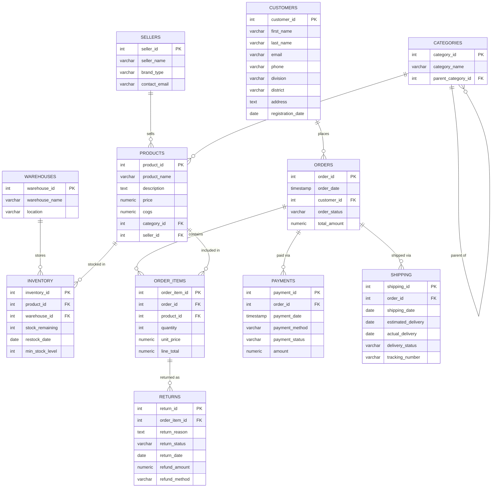

# SalesDB — Lab Report
## Part 1: Problem Statement, Project Overview, Features, and Technologies

---

## 1. Problem Statement

Modern e-commerce and retail businesses generate vast transactional data across sellers, customers, products, warehouses, and payments. Without structured database management and analytical tooling, critical business questions remain unanswered:

- Which products and sellers are driving or hurting revenue?
- Are there inactive sellers or fraudulent customers?
- How is inventory health across warehouses?
- What are the profit margins per product and category?
- Where are revenue drops happening, and why?

This project addresses these challenges by building a **full-stack Sales Database Management System (DBMS)** backed by PostgreSQL (via Supabase), with a React-based dashboard frontend and a Node.js/Express backend API layer.

---

## 2. Scope

The system covers end-to-end database design, data population, analytical query engineering, and interactive dashboard delivery for a simulated e-commerce business. Specifically:

- **Data Modeling**: 11 core relational tables covering the full order lifecycle
- **Data Population**: Synthetic CSV data spanning multiple years (2016–2025), including fraud-pattern datasets
- **Analytical Coverage**: 8 development phases from basic aggregations to deep predictive intelligence
- **API Layer**: RESTful Express.js API serving 40+ endpoints
- **Frontend**: React-based multi-page dashboard application with **60+** interactive chart components
Got it! Here’s an expanded and detailed version of that sentence using clear bullet points:
* **Highly engaging**
  * Captures the reader’s attention immediately.
  * Uses visually appealing elements that maintain interest.
* **Extremely detailed**
  * Provides in-depth explanations rather than surface-level summaries.
  * Includes comprehensive data, examples, and supporting information.
* **Containing hundreds of graphs**
  * Uses a large number of visual representations to illustrate data.
  * Helps readers interpret trends, comparisons, and patterns easily.
  * Reduces reliance on lengthy textual explanations.
  * Enhances clarity by presenting statistical or analytical results visually.
- **Database Automation**: Triggers for inventory management, order automation, and fraud detection

---

## 3. Project Overview

**Project Name**: SalesDB — E-Commerce Sales Analytics Platform  
**Stack**: PostgreSQL (Supabase) · Node.js · Express.js · React.js · Recharts

The system is structured as a **monorepo** with three top-level directories:

| Directory | Purpose |
|---|---|
| `db/` | All SQL scripts: schema, views, functions, triggers, data generation |
| `server/` | Node.js/Express REST API with Supabase client integration |
| `client/` | React SPA with dashboards for each analytics phase |

The application is accessed through a **Landing Page** that navigates to specialized dashboard pages:

- **Overview Page** — high-level KPI summary
- **Analytics Page** — multi-phase analytics dashboards
- **Data Management Page** — insert/update/delete operations
- **Inactive Sellers Page** — Phase 4 seller segmentation
- **Returns Page** — Phase 5 returns risk analysis
- **Integrity Page** — data integrity and fraud pattern dashboards

---

## 4. List of Features

### Phase 1 — Schema & Foundation
| Feature | Description |
|---|---|
| Relational Schema | 11 normalized tables: sellers, customers, warehouses, categories, products, orders, order_items, payments, shipping, returns, inventory |
| Foreign Key Constraints | Enforced referential integrity across all relationships |
| Self-Referencing Category | `parent_category_id` enables hierarchical category tree |

---

### Phase 2 — Core Transactional Dashboards

| Feature | Description |
|---|---|
| **Daily Sales Dashboard** | Tracks daily sales amount, total orders, and items sold with year filtering. Uses line charts with gradient fills and a detailed data table with AOV. |
| **Quantity Sold Dashboard** | Multi-view dashboard (Per Product, Per Year, Per Category, Per Category & Year) with tab navigation. Uses bar charts and pie charts. |
| **Revenue Per Product Dashboard** | Horizontal bar chart ranking products by revenue with year filtering and revenue share percentage. |
| **Revenue Per Seller Dashboard** | Ranks sellers by revenue and products sold using dual horizontal bar charts. |
| **Revenue Per Category Dashboard** | Dual pie charts and dual horizontal bar charts showing revenue and quantity distribution across categories. |

---

### Phase 3 — Time-Based & Customer Metrics

| Feature | Description |
|---|---|
| **Monthly Revenue Per Year** | Grouped monthly revenue trend across all years on a single chart |
| **Monthly Order Count** | Order volume per month with all-years and per-year toggle |
| **Monthly Sales Trend** | Unified monthly sales trend combining revenue and order count |
| **Average Order Value (AOV)** | Monthly AOV with min, max, and median order values per month |
| **Customer Lifetime Value (CLTV)** | Customer segmentation (VIP, High Value, Medium Value, Low Value) based on total spend, order frequency, and lifetime days |

---

### Phase 4 — Advanced Ranking & Segmentation

| Feature | Description |
|---|---|
| **Inactive Sellers Detection** | Date-range configurable detection of sellers with zero transactions. Returns total sellers, inactive count, inactive ratio, per-month trend, and a full inactive seller list with days since last sale. |

---

### Phase 5 — Returns, Loss & Risk Analysis

| Feature | Description |
|---|---|
| **Most Returned Products** | All-time, per-year, and per-month tabbed views of top returned products |
| **Return Rate per Product** | Percentage-based return rate analysis across time dimensions |
| **Revenue Loss Due to Returns** | Monetary impact of approved returns aggregated by product, year, and month |

---

### Phase 6 — Profit Loss Analytics

| Feature | Description |
|---|---|
| **Product Profit Margin** | Per-product profit margin % using cursor-based PL/pgSQL function with COGS vs. revenue comparison |
| **Category Profit Margin** | Category-level aggregated profit margins |
| **Revenue Decrease Ratio (YoY)** | Year-over-year revenue and order change percentage with increase/decrease classification |
| **Year-over-Year Revenue Growth** | Detailed YoY growth dashboard with monthly comparison breakdowns |

---

### Phase 7 — Triggers & Automation

| Feature | Description |
|---|---|
| **Auto-Update Order Total** | AFTER INSERT/UPDATE/DELETE trigger on `order_items` recalculates `orders.total_amount` automatically |
| **Enforce Stock Limit on Sale** | BEFORE INSERT trigger on `order_items` prevents sale if stock is insufficient and deducts stock on valid sale |

---

### Phase 8 — Advanced Deep Analytics

| Feature | Description |
|---|---|
| **Fraud — Multiple Failed Payments** | Detects customers with 2+ failed payments within a configurable recent window |
| **Fraud — High Return Rate Customers** | Flags customers exceeding minimum return count and return percentage thresholds |
| **Fraud — Seller Return Monitoring** | Identifies sellers with abnormally high return rates in recent periods and all-time |
| **Revenue Drop Analysis** | Monthly, weekly, and yearly revenue drop detection with severity classification and recommendations |
| **Low Stock Detection** | Lists products below `min_stock_level` with deficit quantity and deficit percentage |
| **Fast-Moving Products** | Demand intelligence identifying high-velocity products |
| **Warehouse Load Intelligence** | Per-warehouse capacity score, product count, unit totals, and low-stock count |
| **Inventory Risk & Priority Score** | Multi-factor function scoring each product: CRITICAL / HIGH / MEDIUM / OVERSTOCKED / LOW with recommended actions |

---

## 5. Tools and Technologies Used

### Backend
| Tool | Version | Purpose |
|---|---|---|
| **Node.js** | v18+ | Runtime environment for the API server |
| **Express.js** | v4 | REST API framework |
| **@supabase/supabase-js** | v2 | PostgreSQL client connecting to Supabase cloud |
| **CORS** | — | Cross-origin request handling |
| **dotenv** | — | Environment variable management |

### Frontend
| Tool | Version | Purpose |
|---|---|---|
| **React.js** | v18 | UI component framework |
| **React Router DOM** | v6 | Client-side routing between pages |
| **Recharts** | v2 | All chart visualizations (Line, Bar, Pie, Area) |
| **Axios** | — | HTTP requests from frontend to backend API |
| **CSS Modules / Inline Styles** | — | Component-level styling |

### Database
| Tool | Purpose |
|---|---|
| **PostgreSQL 15** | Core relational database engine |
| **Supabase** | Hosted PostgreSQL platform with REST/RPC API |
| **PL/pgSQL** | Procedural language for functions, cursors, and triggers |
| **SQL Views** | Pre-computed query results for dashboard performance |

### Development Tools
| Tool | Purpose |
|---|---|
| **JetBrains IDE / VS Code** | Code editing and project management |
| **Git / GitHub** | Version control and collaboration |
| **Postman** | API endpoint testing |
| **pgAdmin / Supabase Studio** | Database administration and query testing |

---


## Part 2: Database Design

---

## 1. Overview

The SalesDB database follows a **fully normalized relational schema** (3NF) hosted on **Supabase (PostgreSQL 15)**. The schema models a complete e-commerce order lifecycle — from seller and product registration, customer ordering, payment processing, shipping, inventory management, and returns.

The database consists of **11 core tables** with enforced primary keys, foreign key constraints, and one self-referencing relationship.

---

## 2. Entity-Relationship Diagram (ERD)

The following Mermaid ERD represents all tables and their relationships:



---


## 3. Table Descriptions

### 3.1 `sellers`
Stores seller/vendor information.

| Column | Type | Notes |
|---|---|---|
| `seller_id` | INT | Primary Key |
| `seller_name` | VARCHAR | Store/brand name |
| `brand_type` | VARCHAR | e.g., "Official Store", "3rd Party" |
| `contact_email` | VARCHAR | Seller contact |

**Role**: Root entity for product ownership. Used in revenue analytics, seller performance dashboards and fraud detection.

---

### 3.2 `categories`
Stores product categories with **self-referencing hierarchy** for parent-child category trees.

| Column | Type | Notes |
|---|---|---|
| `category_id` | INT | Primary Key |
| `category_name` | VARCHAR | e.g., "Electronics", "Mobile Phones" |
| `parent_category_id` | INT | FK → `categories.category_id` (nullable) |

**Role**: Enables hierarchical product classification. Used in category-level revenue and profit analytics.

---

### 3.3 `products`
Core product catalog table linking sellers and categories.

| Column | Type | Notes |
|---|---|---|
| `product_id` | INT | Primary Key |
| `product_name` | VARCHAR | Product display name |
| `description` | TEXT | Long-form product description |
| `price` | NUMERIC | Selling price |
| `cogs` | NUMERIC | Cost of Goods Sold — used for profit margin calculation |
| `category_id` | INT | FK → `categories` |
| `seller_id` | INT | FK → `sellers` |

**Role**: Central reference for analytics. `cogs` enables margin calculation without a separate cost table.

---

### 3.4 `customers`
Customer profile data including geographic segmentation.

| Column | Type | Notes |
|---|---|---|
| `customer_id` | INT | Primary Key |
| `first_name` / `last_name` | VARCHAR | Full name |
| `email` | VARCHAR | Unique contact |
| `phone` | VARCHAR | — |
| `division` | VARCHAR | Regional classification (Bangladesh divisions) |
| `district` | VARCHAR | Sub-regional classification |
| `address` | TEXT | Full address |
| `registration_date` | DATE | Customer acquisition date |

**Role**: Used in CLTV (Customer Lifetime Value) analytics and fraud detection patterns.

---

### 3.5 `warehouses`
Physical warehouse locations.

| Column | Type | Notes |
|---|---|---|
| `warehouse_id` | INT | Primary Key |
| `warehouse_name` | VARCHAR | Warehouse label |
| `location` | VARCHAR | City or address |

**Role**: Used in inventory intelligence and warehouse load analytics.

---

### 3.6 `inventory`
Tracks stock levels per product per warehouse.

| Column | Type | Notes |
|---|---|---|
| `inventory_id` | INT | Primary Key |
| `product_id` | INT | FK → `products` |
| `warehouse_id` | INT | FK → `warehouses` |
| `stock_remaining` | INT | Current available stock |
| `restock_date` | DATE | Last restock date |
| `min_stock_level` | INT | Minimum safe stock threshold — used by triggers |

**Role**: Core table for inventory intelligence, low-stock detection, warehouse load, and the stock-enforcement trigger.

---

### 3.7 `orders`
Order header table.

| Column | Type | Notes |
|---|---|---|
| `order_id` | INT | Primary Key |
| `order_date` | TIMESTAMP | When order was placed |
| `customer_id` | INT | FK → `customers` |
| `order_status` | VARCHAR | e.g., Pending, Shipped, Completed, Cancelled, Refunded |
| `total_amount` | NUMERIC | Auto-calculated via trigger from `order_items` |

**Role**: Central table for all time-based and revenue analytics. `total_amount` is maintained automatically by the `trigger_update_order_total` trigger.

---

### 3.8 `order_items`
Line items within each order.

| Column | Type | Notes |
|---|---|---|
| `order_item_id` | INT | Primary Key |
| `order_id` | INT | FK → `orders` |
| `product_id` | INT | FK → `products` |
| `quantity` | INT | Units ordered |
| `unit_price` | NUMERIC | Price at time of purchase |
| `line_total` | NUMERIC | `quantity × unit_price` |

**Role**: Most commonly joined table in the system. All revenue, quantity, and profit calculations flow through `order_items`.

---

### 3.9 `payments`
Payment records per order.

| Column | Type | Notes |
|---|---|---|
| `payment_id` | INT | Primary Key |
| `order_id` | INT | FK → `orders` |
| `payment_date` | TIMESTAMP | When payment was processed |
| `payment_method` | VARCHAR | e.g., Credit Card, COD, Mobile Banking |
| `payment_status` | VARCHAR | SUCCESS, FAILED, PENDING |
| `amount` | NUMERIC | Payment amount |

**Role**: Used in fraud detection (multiple failed payment pattern).

---

### 3.10 `shipping`
Shipping and delivery tracking per order.

| Column | Type | Notes |
|---|---|---|
| `shipping_id` | INT | Primary Key |
| `order_id` | INT | FK → `orders` |
| `shipping_date` | DATE | Dispatch date |
| `estimated_delivery` | DATE | Expected arrival |
| `actual_delivery` | DATE | Actual arrival |
| `delivery_status` | VARCHAR | e.g., In Transit, Delivered |
| `tracking_number` | VARCHAR | Courier reference |

**Role**: Supports delivery fulfillment analysis and order completion logic (Phase 7).

---

### 3.11 `returns`
Product return records linked to specific order line items.

| Column | Type | Notes |
|---|---|---|
| `return_id` | INT | Primary Key |
| `order_item_id` | INT | FK → `order_items` |
| `return_reason` | TEXT | Customer-provided reason |
| `return_status` | VARCHAR | Pending, Approved, Rejected |
| `return_date` | DATE | When return was filed |
| `refund_amount` | NUMERIC | Monetary refund value |
| `refund_method` | VARCHAR | Refund channel |

**Role**: Central table for Phase 5 returns analytics, revenue loss calculation, and seller/customer fraud detection.

---

## 4. Key Design Decisions

### 4.1 COGS in Products Table
Rather than a separate cost ledger, `cogs` (Cost of Goods Sold) is stored per product. This simplifies profit margin calculations while being accurate for a per-product cost model.

### 4.2 Self-Referencing Categories
The `parent_category_id` FK on `categories` enables a hierarchical category structure (e.g., *Electronics → Mobile Phones → Smartphones*) without requiring a separate table.

### 4.3 Denormalized `total_amount` in Orders
`orders.total_amount` is a derived field (sum of `order_items.line_total`), but is persisted in the table and kept in sync via a database trigger. This avoids expensive real-time aggregations on every order read.

### 4.4 `min_stock_level` in Inventory
Storing the minimum threshold directly in the `inventory` record (rather than a global setting) allows per-product, per-warehouse stock floor customization — critical for the stock enforcement trigger.

### 4.5 Separate Payments and Shipping Tables
A single order can have multiple payment attempts (e.g., an initial FAILED followed by SUCCESS). Separating payments from orders supports fraud detection on multiple failed payment patterns.

---

## 5. Database Views (Phase 2 SQL)

Pre-computed views power the Phase 2 dashboards and are queried directly via Supabase's PostgREST API:

| View Name | Purpose |
|---|---|
| `daily_sales_view` | Daily aggregated sales amount, order count, items sold |
| `daily_sales_years` | Distinct years present in daily sales data |
| `total_quantity_sold_per_product` | All-time quantity per product |
| `quantity_sold_by_year` | Quantity per product per year |
| `quantity_sold_by_category` | Quantity per category (all-time) |
| `quantity_sold_by_category_year` | Quantity per category per year |
| `quantity_sold_years` | Distinct years for quantity sold filtering |
| `product_returns_analytics` | Combined return metrics by product, year, and month |

---

## 6. Sample Data Profile

| Table | Approximate Row Count |
|---|---|
| sellers | ~50 |
| customers | ~500 |
| products | ~200 |
| orders | ~5,000 |
| order_items | ~15,000 |
| payments | ~5,500 |
| shipping | ~4,800 |
| returns | ~1,200 |
| inventory | ~400 |
| warehouses | ~10 |
| categories | ~30 |

Data spans **2016–2025**, with synthetic fraud patterns injected for testing Phase 8 analytics.

---


## Part 4: Advanced SQL — Phase 6, 7 & 8

---

## Phase 6 — Profit Loss Analytics

### 6.1 FUNCTION: `get_product_profit_margin` (Cursor-Based)

```sql
CREATE OR REPLACE FUNCTION get_product_profit_margin(p_year INT DEFAULT NULL)
RETURNS TABLE(
    product_id             INT,
    product_name           VARCHAR,
    category_name          VARCHAR,
    total_revenue          NUMERIC,
    total_cost             NUMERIC,
    total_profit           NUMERIC,
    profit_margin_percentage NUMERIC,
    total_units_sold       INT,
    avg_profit_per_unit    NUMERIC,
    avg_selling_price      NUMERIC,
    avg_cost_price         NUMERIC
)
LANGUAGE plpgsql
AS $$
DECLARE
    rec RECORD;
    cur CURSOR FOR
        SELECT
            p.product_id,
            p.product_name,
            c.category_name,
            SUM(oi.quantity * oi.unit_price)::NUMERIC                     AS revenue,
            SUM(oi.quantity * p.cogs)::NUMERIC                            AS cost,
            (SUM(oi.quantity * oi.unit_price) - SUM(oi.quantity * p.cogs))::NUMERIC AS profit,
            CASE
                WHEN SUM(oi.quantity * oi.unit_price) > 0
                THEN ((SUM(oi.quantity * oi.unit_price) - SUM(oi.quantity * p.cogs))
                      / SUM(oi.quantity * oi.unit_price) * 100)::NUMERIC
                ELSE 0
            END AS profit_margin_pct,
            SUM(oi.quantity)::INT                                         AS units_sold,
            CASE
                WHEN SUM(oi.quantity) > 0
                THEN ((SUM(oi.quantity * oi.unit_price) - SUM(oi.quantity * p.cogs))
                      / SUM(oi.quantity))::NUMERIC
                ELSE 0
            END AS avg_profit_unit,
            CASE
                WHEN SUM(oi.quantity) > 0
                THEN (SUM(oi.quantity * oi.unit_price) / SUM(oi.quantity))::NUMERIC
                ELSE 0
            END AS avg_sell_price,
            p.cogs::NUMERIC AS avg_cost
        FROM products p
        JOIN categories c  ON p.category_id = c.category_id
        JOIN order_items oi ON p.product_id = oi.product_id
        JOIN orders o      ON oi.order_id   = o.order_id
        WHERE (p_year IS NULL OR EXTRACT(YEAR FROM o.order_date)::INT = p_year)
        GROUP BY p.product_id, p.product_name, c.category_name, p.cogs
        ORDER BY profit DESC;
BEGIN
    OPEN cur;
    LOOP
        FETCH cur INTO rec;
        EXIT WHEN NOT FOUND;
        product_id               := rec.product_id;
        product_name             := rec.product_name;
        category_name            := rec.category_name;
        total_revenue            := rec.revenue;
        total_cost               := rec.cost;
        total_profit             := rec.profit;
        profit_margin_percentage := rec.profit_margin_pct;
        total_units_sold         := rec.units_sold;
        avg_profit_per_unit      := rec.avg_profit_unit;
        avg_selling_price        := rec.avg_sell_price;
        avg_cost_price           := rec.avg_cost;
        RETURN NEXT;
    END LOOP;
    CLOSE cur;
END;
$$;
```

**Advanced Concepts Used**:
- **Explicit cursor with OPEN/FETCH/CLOSE** — demonstrates PL/pgSQL procedural cursor lifecycle
- **Profit margin formula**: $\text{margin\%} = \frac{\text{revenue} - \text{cost}}{\text{revenue}} \times 100$
- **COGS integration**: `p.cogs` (Cost of Goods Sold) is stored per product; multiplying by quantity gives total cost
- **Guarded division with `CASE WHEN SUM(...) > 0`** — handles products with zero revenue safely

---

### 6.2 FUNCTION: `get_revenue_decrease_ratio` (Year-over-Year)

```sql
CREATE OR REPLACE FUNCTION get_revenue_decrease_ratio()
RETURNS TABLE(
    current_year          INT,
    previous_year         INT,
    current_year_revenue  NUMERIC,
    previous_year_revenue NUMERIC,
    revenue_change        NUMERIC,
    change_percentage     NUMERIC,
    change_type           TEXT,
    current_year_orders   INT,
    previous_year_orders  INT,
    order_change          INT,
    order_change_percentage NUMERIC
)
LANGUAGE plpgsql
AS $$
BEGIN
    RETURN QUERY
    WITH yearly_stats AS (
        SELECT
            EXTRACT(YEAR FROM o.order_date)::INT AS year,
            SUM(o.total_amount)::NUMERIC         AS total_revenue,
            COUNT(DISTINCT o.order_id)::INT       AS total_orders
        FROM orders o
        WHERE o.order_status NOT IN ('Cancelled', 'Refunded')
        GROUP BY EXTRACT(YEAR FROM o.order_date)
    ),
    year_comparison AS (
        SELECT
            curr.year                            AS curr_year,
            prev.year                            AS prev_year,
            curr.total_revenue                   AS curr_revenue,
            prev.total_revenue                   AS prev_revenue,
            (curr.total_revenue - prev.total_revenue)::NUMERIC AS rev_change,
            CASE
                WHEN prev.total_revenue > 0
                THEN ((curr.total_revenue - prev.total_revenue)
                      / prev.total_revenue * 100)::NUMERIC
                ELSE 0
            END AS change_pct,
            CASE
                WHEN curr.total_revenue > prev.total_revenue THEN 'Increase'
                WHEN curr.total_revenue < prev.total_revenue THEN 'Decrease'
                ELSE 'No Change'
            END AS chg_type,
            curr.total_orders                    AS curr_orders,
            prev.total_orders                    AS prev_orders,
            (curr.total_orders - prev.total_orders)::INT AS ord_change,
            CASE
                WHEN prev.total_orders > 0
                THEN ((curr.total_orders - prev.total_orders)::NUMERIC
                      / prev.total_orders * 100)::NUMERIC
                ELSE 0
            END AS ord_change_pct
        FROM yearly_stats curr
        LEFT JOIN yearly_stats prev ON prev.year = curr.year - 1
        WHERE prev.year IS NOT NULL
    )
    SELECT curr_year, prev_year, curr_revenue, prev_revenue,
           rev_change, change_pct, chg_type, curr_orders,
           prev_orders, ord_change, ord_change_pct
    FROM year_comparison
    ORDER BY curr_year DESC;
END;
$$;
```

**Advanced Concepts Used**:
- **Self-join on CTE** (`LEFT JOIN yearly_stats prev ON prev.year = curr.year - 1`) — compares each year to the immediately preceding year without a subquery per row
- **`WHERE prev.year IS NOT NULL`** — filters out the earliest year that has no prior comparison year
- **Dual CTE chaining** (`yearly_stats` → `year_comparison`) — first aggregates, then computes deltas in a clean two-step pipeline

---

### 6.3 FUNCTION: `get_yoy_revenue_growth` (Rich Multi-Metric)

```sql
-- Key excerpt: multiple CTEs + top growth/decline category detection
WITH current_year_data AS (
    SELECT SUM(o.total_amount)::NUMERIC AS revenue, ...
    FROM orders o WHERE EXTRACT(YEAR FROM o.order_date)::INT = target_year
    AND o.order_status NOT IN ('Cancelled', 'Refunded')
),
previous_year_data AS (
    SELECT SUM(o.total_amount)::NUMERIC AS revenue, ...
    FROM orders o WHERE EXTRACT(YEAR FROM o.order_date)::INT = target_year - 1
    AND o.order_status NOT IN ('Cancelled', 'Refunded')
),
category_growth AS (
    SELECT c.category_name,
        ((curr_rev - prev_rev) / NULLIF(prev_rev, 0) * 100) AS growth_pct
    FROM ...
    ORDER BY growth_pct DESC
)
SELECT ...,
    (SELECT category_name FROM category_growth ORDER BY growth_pct DESC LIMIT 1) AS top_growth_category,
    (SELECT category_name FROM category_growth ORDER BY growth_pct ASC  LIMIT 1) AS top_decline_category
FROM ... ;
```

**Advanced Concepts Used**:
- **Scalar subqueries in SELECT** to pick the single top-growth and top-decline category
- **`NULLIF(prev_rev, 0)`** division guard
- **Multi-CTE pipeline** with 4+ CTEs for clean staged computation
- Returns: YoY % change, order count comparison, customer count, AOV growth, top/decline category

---

### 6.4 FUNCTION: `get_monthly_revenue_drop_analysis`

**Key concept excerpt**:

```sql
CREATE OR REPLACE FUNCTION get_monthly_revenue_drop_analysis(
    p_threshold_percent NUMERIC DEFAULT 20
)
RETURNS TABLE( ... recommendations TEXT )
LANGUAGE plpgsql
AS $$
DECLARE
    rec RECORD;
    reference_date DATE := '2025-12-31'::DATE;
BEGIN
    FOR rec IN
        WITH month_series AS (
            SELECT generate_series(
                min_date + INTERVAL '1 month',
                LEAST(max_date, DATE_TRUNC('month', reference_date)),
                INTERVAL '1 month'
            )::DATE AS month_start
        ), ...
    LOOP
        -- Classify severity: 'Severe Drop', 'Moderate Drop', 'Slight Drop', 'Growth'
        -- Identify worst-performing category and seller for that month
        -- Generate text recommendation
        RETURN NEXT;
    END LOOP;
END;
$$;
```

**Advanced Concepts Used**:
- **`generate_series`** for gap-free month iteration
- **`FOR rec IN`** loop — implicit cursor over a complex multi-CTE query
- **`LEAST(max_date, reference_date)`** — caps analysis to the reference date, preventing future-month comparisons
- **`recommendations TEXT`** output — generates human-readable advice (e.g., "Investigate decline in Electronics category")
- **Severity classification** using configurable `p_threshold_percent`

---

## Phase 7 — Triggers & Database Automation

### 7.1 TRIGGER: Auto-Update Order Total Amount

```sql
-- Step 1: Trigger Function
CREATE OR REPLACE FUNCTION update_order_total()
RETURNS TRIGGER AS $$
BEGIN
    UPDATE orders
    SET total_amount = (
        SELECT COALESCE(SUM(line_total), 0)
        FROM order_items
        WHERE order_id = COALESCE(NEW.order_id, OLD.order_id)
    )
    WHERE order_id = COALESCE(NEW.order_id, OLD.order_id);
    RETURN NEW;
END;
$$ LANGUAGE plpgsql;

-- Step 2: Attach Trigger
CREATE TRIGGER trigger_update_order_total
AFTER INSERT OR UPDATE OR DELETE ON order_items
FOR EACH ROW
EXECUTE FUNCTION update_order_total();
```

**Explanation**:
- Fires **AFTER** any DML on `order_items`
- `COALESCE(NEW.order_id, OLD.order_id)` — handles all three operations: INSERT (NEW exists), DELETE (OLD exists), UPDATE (NEW exists)
- Recalculates `orders.total_amount` as the fresh sum of all current `line_total` values for that order
- Ensures `total_amount` is always accurate without requiring application-layer calculation

---

### 7.2 TRIGGER: Enforce Stock Limit on Sale

```sql
CREATE OR REPLACE FUNCTION fn_enforce_stock_limit_on_sale()
RETURNS TRIGGER AS $$
DECLARE
    current_stock INT;
BEGIN
    SELECT stock_remaining INTO current_stock
    FROM inventory
    WHERE product_id = NEW.product_id;

    IF current_stock IS NULL OR current_stock < NEW.quantity THEN
        RAISE EXCEPTION
            'Inventory Error: Insufficient stock for Product ID %. Available: %, Requested: %',
            NEW.product_id, COALESCE(current_stock, 0), NEW.quantity;
    END IF;

    UPDATE inventory
    SET stock_remaining = stock_remaining - NEW.quantity
    WHERE product_id = NEW.product_id;

    RETURN NEW;
END;
$$ LANGUAGE plpgsql;

CREATE TRIGGER trg_inventory_enforce_stock_limit_on_sale
BEFORE INSERT ON order_items
FOR EACH ROW
EXECUTE FUNCTION fn_enforce_stock_limit_on_sale();
```

**Explanation**:
- Fires **BEFORE INSERT** on `order_items` — the insertion is blocked before it commits if stock is insufficient
- **`RAISE EXCEPTION`** returns a descriptive error message to the calling application, including the product ID, available stock, and requested quantity
- **Automatic stock deduction**: On valid insert, `stock_remaining` is reduced by the ordered quantity — no application code needed
- This is both a **validation trigger** (prevent bad data) and an **automation trigger** (maintain inventory)

---

## Phase 8 — Advanced Deep Analytics

### 8.1 FUNCTION: `get_multiple_failed_payments` (Fraud Detection)

```sql
CREATE OR REPLACE FUNCTION get_multiple_failed_payments(
    p_days        INT DEFAULT 15,
    p_min_attempts INT DEFAULT 2
)
RETURNS TABLE(
    customer_id    INT,
    first_name     VARCHAR,
    last_name      VARCHAR,
    email          VARCHAR,
    failed_attempts BIGINT,
    last_failed_date TIMESTAMP
)
LANGUAGE plpgsql
AS $$
BEGIN
    RETURN QUERY
    SELECT c.customer_id, c.first_name, c.last_name, c.email,
           COUNT(p.payment_id)    AS failed_attempts,
           MAX(p.payment_date)    AS last_failed_date
    FROM customers c
    JOIN orders o   ON o.customer_id = c.customer_id
    JOIN payments p ON p.order_id    = o.order_id
    WHERE p.payment_status = 'FAILED'
      AND p.payment_date >= DATE '2025-12-31' - (p_days * INTERVAL '1 day')
    GROUP BY c.customer_id, c.first_name, c.last_name, c.email
    HAVING COUNT(p.payment_id) >= p_min_attempts
    ORDER BY failed_attempts DESC;
END;
$$;
```

**Advanced Concepts Used**:
- **Configurable lookback window** (`p_days`) — analysts can adjust the detection period
- **`HAVING` clause** filters for fraud threshold (≥ N failed attempts) after grouping
- **Dynamic interval**: `(p_days * INTERVAL '1 day')` constructs the time window programmatically

---

### 8.2 FUNCTION: `get_high_return_customers` (Fraud Detection)

```sql
CREATE OR REPLACE FUNCTION get_high_return_customers(
    p_min_returns    INT     DEFAULT 3,
    p_min_percentage NUMERIC DEFAULT 10
)
RETURNS TABLE( customer_id INT, ..., return_percentage NUMERIC )
LANGUAGE plpgsql
AS $$
BEGIN
    RETURN QUERY
    SELECT c.customer_id, c.first_name, c.last_name, c.email,
           COUNT(r.return_id)            AS total_returns,
           COUNT(oi.order_item_id)       AS total_items,
           ROUND(
               COUNT(r.return_id)::NUMERIC
               / NULLIF(COUNT(oi.order_item_id), 0) * 100, 2
           )                             AS return_percentage
    FROM customers c
    JOIN orders o    ON o.customer_id = c.customer_id
    JOIN order_items oi ON oi.order_id  = o.order_id
    LEFT JOIN returns r ON r.order_item_id = oi.order_item_id
    GROUP BY c.customer_id, c.first_name, c.last_name, c.email
    HAVING COUNT(r.return_id) >= p_min_returns
       AND (COUNT(r.return_id)::NUMERIC
            / NULLIF(COUNT(oi.order_item_id), 0) * 100) > p_min_percentage
    ORDER BY return_percentage DESC;
END;
$$;
```

**Advanced Concepts Used**:
- **Dual `HAVING` condition** — both absolute threshold AND percentage threshold must be met
- **`NULLIF` in `HAVING`** — prevents division-by-zero in the HAVING filter itself
- **`LEFT JOIN returns`** — customers with zero returns are included as 0%, not excluded

---

### 8.3 FUNCTION: `get_low_stock_products`

```sql
CREATE OR REPLACE FUNCTION get_low_stock_products()
RETURNS TABLE(
    product_id         INT,
    product_name       VARCHAR,
    warehouse_name     VARCHAR,
    warehouse_id       INT,
    stock_remaining    INT,
    min_stock_level    INT,
    stock_deficit      INT,
    deficit_percentage NUMERIC
)
LANGUAGE plpgsql
AS $$
BEGIN
    RETURN QUERY
    SELECT
        i.product_id, p.product_name, w.warehouse_name, w.warehouse_id,
        i.stock_remaining, i.min_stock_level,
        (i.min_stock_level - i.stock_remaining)::INT AS stock_deficit,
        ROUND(
            ((i.min_stock_level - i.stock_remaining)::NUMERIC
             / NULLIF(i.min_stock_level, 0) * 100), 2
        ) AS deficit_percentage
    FROM inventory i
    JOIN products p   ON p.product_id   = i.product_id
    JOIN warehouses w ON w.warehouse_id = i.warehouse_id
    WHERE i.stock_remaining <= i.min_stock_level
    ORDER BY deficit_percentage DESC, stock_deficit DESC;
END;
$$;
```

**Explanation**: The `WHERE i.stock_remaining <= i.min_stock_level` filter uses per-row thresholds stored in `inventory.min_stock_level`. `deficit_percentage` quantifies how far below safe levels the stock has fallen. Results are ordered by severity (highest deficit % first).

---

### 8.4 FUNCTION: `get_fast_moving_products`

```sql
CREATE OR REPLACE FUNCTION get_fast_moving_products(
    p_days     INT DEFAULT 7,
    p_min_units INT DEFAULT 30
)
RETURNS TABLE( ..., avg_daily_sales NUMERIC, velocity_rating VARCHAR )
LANGUAGE plpgsql
AS $$
BEGIN
    RETURN QUERY
    SELECT p.product_id, p.product_name, c.category_name,
           SUM(oi.quantity) AS units_sold,
           p_days           AS days_analyzed,
           ROUND(SUM(oi.quantity)::NUMERIC / p_days, 2) AS avg_daily_sales,
           CASE
               WHEN SUM(oi.quantity) >= p_min_units * 3 THEN 'Very High'::VARCHAR
               WHEN SUM(oi.quantity) >= p_min_units * 2 THEN 'High'::VARCHAR
               WHEN SUM(oi.quantity) >= p_min_units     THEN 'Medium'::VARCHAR
               ELSE 'Low'::VARCHAR
           END AS velocity_rating
    FROM order_items oi
    JOIN products p   ON p.product_id   = oi.product_id
    JOIN categories c ON c.category_id  = p.category_id
    JOIN orders o     ON o.order_id     = oi.order_id
    WHERE o.order_date >= DATE '2025-12-31' - (p_days || ' days')::INTERVAL
      AND o.order_status NOT IN ('Cancelled', 'Refunded')
    GROUP BY p.product_id, p.product_name, c.category_name
    HAVING SUM(oi.quantity) >= p_min_units
    ORDER BY units_sold DESC;
END;
$$;
```

**Advanced Concepts Used**:
- **Velocity rating via CASE WHEN multiplier** (`p_min_units * 3`, `* 2`) — scales threshold relative to the configurable parameter
- **Dynamic interval construction**: `(p_days || ' days')::INTERVAL`
- **`HAVING SUM(oi.quantity) >= p_min_units`** — filters below-threshold products after aggregation

---

### 8.5 FUNCTION: `get_inventory_intelligence_score`

```sql
-- Key scoring logic (condensed):
CASE
    WHEN stock_remaining <= min_stock_level AND units_sold > p_high_velocity_threshold
        THEN 'CRITICAL'      -- priority_score = 1
    WHEN stock_remaining <= min_stock_level
        THEN 'HIGH'          -- priority_score = 2
    WHEN units_sold > p_high_velocity_threshold
        THEN 'MEDIUM'        -- priority_score = 3
    WHEN stock_remaining > min_stock_level * 3 AND units_sold < 10
        THEN 'OVERSTOCKED'   -- priority_score = 4
    ELSE 'LOW'               -- priority_score = 5
END AS inventory_risk,

-- Days of stock remaining calculation:
CASE
    WHEN units_sold > 0
    THEN ROUND((stock_remaining::NUMERIC / (units_sold::NUMERIC / p_days)), 1)
    ELSE 999.9
END AS days_of_stock_remaining
```

**Advanced Concepts Used**:
- **Multi-condition scoring matrix**: Combines low stock AND high velocity for CRITICAL classification
- **Days-of-stock formula**: $\frac{\text{stock\_remaining}}{\text{units\_sold} / \text{days}} = \text{days until stockout}$
- **`999.9` sentinel value**: Represents "infinite" days of stock for zero-velocity products
- **CTE `sales_data`**: First aggregates recent sales, then joins to inventory for the scoring pass

---

### 8.6 FUNCTION: `get_warehouse_load_intelligence`

```sql
SELECT
    w.warehouse_id, w.warehouse_name, w.location,
    COUNT(i.inventory_id)                          AS products_stored,
    SUM(i.stock_remaining)                         AS total_units,
    COUNT(CASE WHEN i.stock_remaining <= i.min_stock_level THEN 1 END) AS low_stock_count,
    ROUND(AVG(i.stock_remaining::NUMERIC), 2)      AS avg_stock_per_product,
    CASE
        WHEN SUM(i.stock_remaining) >= 6000 THEN 'High Capacity'
        WHEN SUM(i.stock_remaining) >= 3000 THEN 'Medium Capacity'
        WHEN SUM(i.stock_remaining) >= 1000 THEN 'Low Capacity'
        ELSE 'Very Low'
    END AS utilization_score
FROM warehouses w
JOIN inventory i ON i.warehouse_id = w.warehouse_id
GROUP BY w.warehouse_id, w.warehouse_name, w.location
ORDER BY total_units DESC;
```

**Advanced Concepts Used**:
- **`COUNT(CASE WHEN ... THEN 1 END)`** — conditional count without a WHERE clause, counting low-stock rows within the same aggregation pass
- **Capacity tier classification** via absolute thresholds on total unit count

---

## Summary Table: SQL Objects by Phase

| Phase | Type | Object Name | Key Concept |
|---|---|---|---|
| 1 | TABLE | `orders`, `inventory`, `categories` | Schema, FK, self-reference |
| 2 | VIEW | `daily_sales_view` | Date aggregation |
| 2 | FUNCTION | `get_revenue_per_seller` | Explicit cursor |
| 2 | VIEW | `quantity_sold_by_*` | Category/product aggregation |
| 3 | FUNCTION | `get_monthly_revenue_per_year` | Cursor, TO_CHAR |
| 3 | FUNCTION | `get_average_order_value` | PERCENTILE_CONT, CTE |
| 3 | FUNCTION | `get_customer_lifetime_value` | Segmentation, CONCAT, CTE |
| 4 | FUNCTION | `get_inactive_sellers_analytics` | generate_series, json_build_object, NOT IN |
| 5 | VIEW | `product_returns_analytics` | COUNT FILTER, LEFT JOIN |
| 6 | FUNCTION | `get_product_profit_margin` | Cursor, COGS math |
| 6 | FUNCTION | `get_revenue_decrease_ratio` | Self-join CTE |
| 6 | FUNCTION | `get_yoy_revenue_growth` | Multi-CTE, scalar subquery |
| 6 | FUNCTION | `get_monthly_revenue_drop_analysis` | generate_series, FOR loop, LEAST |
| 7 | TRIGGER | `trigger_update_order_total` | AFTER INSERT/UPDATE/DELETE |
| 7 | TRIGGER | `trg_inventory_enforce_stock_limit_on_sale` | BEFORE INSERT, RAISE EXCEPTION |
| 8 | FUNCTION | `get_multiple_failed_payments` | HAVING, dynamic interval |
| 8 | FUNCTION | `get_high_return_customers` | Dual HAVING, NULLIF |
| 8 | FUNCTION | `get_low_stock_products` | Per-row threshold comparison |
| 8 | FUNCTION | `get_fast_moving_products` | Velocity rating, HAVING |
| 8 | FUNCTION | `get_inventory_intelligence_score` | Multi-factor scoring, CTE |
| 8 | FUNCTION | `get_warehouse_load_intelligence` | Conditional COUNT |

---

## Part 3: Procedural SQL — Phase 1 through Phase 5

---

## Overview

This section documents all SQL constructs from Phase 1 (Schema) through Phase 5 (Returns & Risk Analysis). Each item includes the object type (VIEW, FUNCTION, TRIGGER, QUERY), a code snippet, and a detailed explanation.

---

## Phase 1 — Schema Creation

### 1.1 Table: `orders`

```sql
CREATE TABLE public.orders (
  order_id   integer NOT NULL,
  order_date timestamp without time zone,
  customer_id integer,
  order_status character varying,
  total_amount numeric,
  CONSTRAINT orders_pkey PRIMARY KEY (order_id),
  CONSTRAINT orders_customer_id_fkey FOREIGN KEY (customer_id)
    REFERENCES public.customers(customer_id)
);
```

**Explanation**: The `orders` table is the central hub of all transaction data. `order_status` tracks lifecycle stages (Pending → Shipped → Completed / Cancelled / Refunded). `total_amount` is denormalized here for fast reads and kept accurate by an AFTER INSERT/UPDATE/DELETE trigger on `order_items`.

---

### 1.2 Table: `inventory`

```sql
CREATE TABLE public.inventory (
  inventory_id  integer NOT NULL,
  product_id    integer,
  warehouse_id  integer,
  stock_remaining integer,
  restock_date  date,
  min_stock_level integer,
  CONSTRAINT inventory_pkey PRIMARY KEY (inventory_id),
  CONSTRAINT inventory_product_id_fkey FOREIGN KEY (product_id)
    REFERENCES public.products(product_id),
  CONSTRAINT inventory_warehouse_id_fkey FOREIGN KEY (warehouse_id)
    REFERENCES public.warehouses(warehouse_id)
);
```

**Explanation**: `min_stock_level` is the per-row threshold. This enables fine-grained control — a high-demand product in a large warehouse can have a higher minimum than a slow-mover. This design is intentionally exploited by the stock-enforcement trigger.

---

### 1.3 Self-Referencing `categories`

```sql
CREATE TABLE public.categories (
  category_id       integer NOT NULL,
  category_name     character varying,
  parent_category_id integer,
  CONSTRAINT categories_pkey PRIMARY KEY (category_id),
  CONSTRAINT categories_parent_category_id_fkey
    FOREIGN KEY (parent_category_id) REFERENCES public.categories(category_id)
);
```

**Explanation**: The `parent_category_id` references the same `categories` table. This enables a tree structure (e.g., *Clothing → Men's Clothing → Shirts*) without a separate hierarchy table. Products link to leaf or intermediate categories.

---

## Phase 2 — Core Transactional Aggregations

### 2.1 VIEW: `daily_sales_view`

```sql
CREATE OR REPLACE VIEW daily_sales_view AS
SELECT
    DATE(o.order_date)          AS sales_date,
    SUM(oi.line_total)          AS total_sales_amount,
    COUNT(DISTINCT o.order_id)  AS total_orders,
    SUM(oi.quantity)            AS total_quantity_sold
FROM orders o
JOIN order_items oi ON o.order_id = oi.order_id
GROUP BY DATE(o.order_date)
ORDER BY sales_date;
```

**Explanation**: This view is queried directly by the backend route `/api/daily-sales`. It aggregates all order line totals per calendar date. Using `COUNT(DISTINCT o.order_id)` prevents double-counting orders with multiple items. The view is filtered server-side by year range using Supabase `.gte()` / `.lte()`.

---

### 2.2 VIEW: Daily Sales Year Selector

```sql
CREATE OR REPLACE VIEW daily_sales_years AS
SELECT DISTINCT
    EXTRACT(YEAR FROM order_date)::INT AS year
FROM orders
ORDER BY year DESC;
```

**Explanation**: This auxiliary view feeds the year dropdown in the Daily Sales Dashboard. It dynamically lists all years for which order data exists, ensuring the frontend filter stays in sync with actual data coverage.

---

### 2.3 FUNCTION: `get_revenue_per_seller`

```sql
CREATE OR REPLACE FUNCTION get_revenue_per_seller(p_year INT DEFAULT NULL)
RETURNS TABLE(
    seller_name       VARCHAR,
    total_revenue     NUMERIC,
    total_products_sold INT
)
LANGUAGE plpgsql
AS $$
DECLARE
    rec RECORD;
    cur CURSOR FOR
        SELECT
            s.seller_name,
            SUM(oi.quantity * oi.unit_price)::NUMERIC AS total_revenue,
            SUM(oi.quantity)::INT AS total_products_sold
        FROM sellers s
        JOIN products p   ON s.seller_id = p.seller_id
        JOIN order_items oi ON p.product_id = oi.product_id
        JOIN orders o     ON o.order_id = oi.order_id
        WHERE (p_year IS NULL OR EXTRACT(YEAR FROM o.order_date)::INT = p_year)
        GROUP BY s.seller_id, s.seller_name
        ORDER BY total_revenue DESC;
BEGIN
    OPEN cur;
    LOOP
        FETCH cur INTO rec;
        EXIT WHEN NOT FOUND;
        seller_name         := rec.seller_name;
        total_revenue       := rec.total_revenue;
        total_products_sold := rec.total_products_sold;
        RETURN NEXT;
    END LOOP;
    CLOSE cur;
END;
$$;
```

**Explanation**: Uses an **explicit cursor** (`CURSOR FOR ... OPEN ... FETCH ... LOOP`) to iterate over seller revenue results. The `p_year` parameter is nullable — when `NULL`, all years are included. This cursor-based approach demonstrates PL/pgSQL procedural iteration rather than a simple `RETURN QUERY`.

---

### 2.4 VIEW: `total_quantity_sold_per_product`

```sql
-- Backing SQL (conceptual - stored as view in Supabase)
SELECT
    p.product_id,
    p.product_name,
    SUM(oi.quantity) AS total_quantity_sold
FROM products p
JOIN order_items oi ON p.product_id = oi.product_id
GROUP BY p.product_id, p.product_name
ORDER BY total_quantity_sold DESC;
```

**Explanation**: Powers the "Per Product" tab in the Quantity Sold Dashboard. Returns the top-performing products by units sold across all time. The view is fetched server-side via Supabase's `.from('total_quantity_sold_per_product').select('*').order(...)`.

---

### 2.5 VIEW: `quantity_sold_by_category`

```sql
-- Backing SQL
SELECT
    c.category_name,
    SUM(oi.quantity) AS total_quantity_sold
FROM categories c
JOIN products p ON c.category_id = p.category_id
JOIN order_items oi ON p.product_id = oi.product_id
GROUP BY c.category_id, c.category_name
ORDER BY total_quantity_sold DESC;
```

**Explanation**: Aggregates sold units by product category. Used in the Pie Chart tab of the Quantity Sold Dashboard and the Revenue Per Category Dashboard.

---

## Phase 3 — Time-Based & Customer-Based Metrics

### 3.1 FUNCTION: `get_monthly_revenue_per_year`

```sql
CREATE OR REPLACE FUNCTION get_monthly_revenue_per_year(p_year INT DEFAULT NULL)
RETURNS TABLE(
    sales_year        INT,
    sales_month       INT,
    month_name        VARCHAR,
    total_revenue     NUMERIC,
    total_orders      INT,
    total_products_sold INT
)
LANGUAGE plpgsql
AS $$
DECLARE
    rec RECORD;
    cur CURSOR FOR
        SELECT
            EXTRACT(YEAR FROM o.order_date)::INT   AS sales_year,
            EXTRACT(MONTH FROM o.order_date)::INT  AS sales_month,
            TO_CHAR(o.order_date, 'Month')         AS month_name,
            SUM(oi.quantity * oi.unit_price)::NUMERIC AS total_revenue,
            COUNT(DISTINCT o.order_id)::INT        AS total_orders,
            SUM(oi.quantity)::INT                  AS total_products_sold
        FROM orders o
        JOIN order_items oi ON o.order_id = oi.order_id
        WHERE (p_year IS NULL OR EXTRACT(YEAR FROM o.order_date)::INT = p_year)
        GROUP BY EXTRACT(YEAR FROM o.order_date),
                 EXTRACT(MONTH FROM o.order_date),
                 TO_CHAR(o.order_date, 'Month')
        ORDER BY sales_year DESC, sales_month ASC;
BEGIN
    OPEN cur;
    LOOP
        FETCH cur INTO rec;
        EXIT WHEN NOT FOUND;
        sales_year := rec.sales_year; sales_month := rec.sales_month;
        month_name := rec.month_name; total_revenue := rec.total_revenue;
        total_orders := rec.total_orders; total_products_sold := rec.total_products_sold;
        RETURN NEXT;
    END LOOP;
    CLOSE cur;
END;
$$;
```

**Explanation**: Returns monthly aggregated revenue, order count, and quantity sold. The `p_year` parameter allows filtering to a specific year or returning all years at once. `TO_CHAR(o.order_date, 'Month')` provides the human-readable month label for chart axis display. Uses a cursor for row-by-row procedural return.

---

### 3.2 FUNCTION: `get_average_order_value`

```sql
CREATE OR REPLACE FUNCTION get_average_order_value(p_year INT DEFAULT NULL)
RETURNS TABLE(
    sales_year        INT,
    sales_month       INT,
    month_name        VARCHAR,
    total_revenue     NUMERIC,
    total_orders      INT,
    avg_order_value   NUMERIC,
    min_order_value   NUMERIC,
    max_order_value   NUMERIC,
    median_order_value NUMERIC
)
LANGUAGE plpgsql
AS $$
BEGIN
    RETURN QUERY
    WITH order_values AS (
        SELECT
            o.order_id,
            EXTRACT(YEAR FROM o.order_date)::INT    AS year_val,
            EXTRACT(MONTH FROM o.order_date)::INT   AS month_val,
            TO_CHAR(o.order_date, 'Month')          AS month_val_name,
            SUM(oi.quantity * oi.unit_price)        AS order_value
        FROM orders o
        JOIN order_items oi ON o.order_id = oi.order_id
        WHERE (p_year IS NULL OR EXTRACT(YEAR FROM o.order_date)::INT = p_year)
        GROUP BY o.order_id, o.order_date
    )
    SELECT
        year_val::INT,
        month_val::INT,
        month_val_name::VARCHAR,
        SUM(order_value)::NUMERIC,
        COUNT(order_id)::INT,
        AVG(order_value)::NUMERIC,
        MIN(order_value)::NUMERIC,
        MAX(order_value)::NUMERIC,
        PERCENTILE_CONT(0.5) WITHIN GROUP (ORDER BY order_value)::NUMERIC
    FROM order_values
    GROUP BY year_val, month_val, month_val_name
    ORDER BY year_val ASC, month_val ASC;
END;
$$;
```

**Advanced Concepts Used**:
- **`PERCENTILE_CONT(0.5)`** — ordered-set aggregate function computing the true statistical median of order values
- **CTE (`WITH order_values`)** — first computes per-order totals, then the outer query aggregates by month
- **`RETURN QUERY`** — simpler than explicit cursor when query result is directly returned

---

### 3.3 FUNCTION: `get_customer_lifetime_value`

```sql
CREATE OR REPLACE FUNCTION get_customer_lifetime_value(p_year INT DEFAULT NULL)
RETURNS TABLE(
    customer_id          INT,
    customer_name        VARCHAR,
    first_purchase_date  DATE,
    last_purchase_date   DATE,
    total_orders         INT,
    total_revenue        NUMERIC,
    avg_order_value      NUMERIC,
    customer_lifetime_days INT,
    purchase_frequency   NUMERIC,
    customer_segment     VARCHAR
)
LANGUAGE plpgsql
AS $$
BEGIN
    RETURN QUERY
    WITH customer_metrics AS (
        SELECT
            c.customer_id,
            CONCAT(c.first_name, ' ', c.last_name) AS customer_name,
            MIN(o.order_date)::DATE AS first_purchase,
            MAX(o.order_date)::DATE AS last_purchase,
            COUNT(DISTINCT o.order_id)::INT AS order_count,
            SUM(oi.quantity * oi.unit_price)::NUMERIC AS revenue,
            AVG(oi.quantity * oi.unit_price)::NUMERIC AS avg_order,
            (MAX(o.order_date)::DATE - MIN(o.order_date)::DATE) AS lifetime_days,
            CASE
                WHEN (MAX(o.order_date)::DATE - MIN(o.order_date)::DATE) > 0
                THEN COUNT(DISTINCT o.order_id)::NUMERIC
                     / (MAX(o.order_date)::DATE - MIN(o.order_date)::DATE)::NUMERIC * 30
                ELSE 0
            END AS frequency
        FROM customers c
        JOIN orders o      ON c.customer_id = o.customer_id
        JOIN order_items oi ON o.order_id = oi.order_id
        WHERE (p_year IS NULL OR EXTRACT(YEAR FROM o.order_date)::INT = p_year)
        GROUP BY c.customer_id, c.first_name, c.last_name
    )
    SELECT
        cm.customer_id::INT,
        cm.customer_name::VARCHAR,
        cm.first_purchase::DATE,
        cm.last_purchase::DATE,
        cm.order_count::INT,
        cm.revenue::NUMERIC,
        cm.avg_order::NUMERIC,
        cm.lifetime_days::INT,
        cm.frequency::NUMERIC,
        CASE
            WHEN cm.revenue >= 6900050 THEN 'VIP'
            WHEN cm.revenue >= 1471000 THEN 'High Value'
            WHEN cm.revenue >= 808000  THEN 'Medium Value'
            ELSE 'Low Value'
        END::VARCHAR AS segment
    FROM customer_metrics cm
    ORDER BY cm.revenue DESC;
END;
$$;
```

**Advanced Concepts Used**:
- **Customer Segmentation via `CASE WHEN`**: Thresholds classify customers into VIP, High Value, Medium Value, Low Value based on cumulative spend
- **Purchase Frequency Formula**: `orders_count / lifetime_days * 30` normalizes to orders-per-month
- **CTE + `RETURN QUERY`**: Two-stage query — first compute per-customer metrics, then segment and sort

---

## Phase 4 — Inactive Sellers Detection

### 4.1 FUNCTION: `get_inactive_sellers_analytics`

```sql
CREATE OR REPLACE FUNCTION get_inactive_sellers_analytics(
    p_start_date DATE,
    p_end_date   DATE
)
RETURNS JSON
LANGUAGE plpgsql
AS $$
DECLARE
    v_result         JSON;
    v_inactive_count INT;
    v_total_sellers  INT;
    v_inactive_ratio NUMERIC;
BEGIN
    SELECT COUNT(*) INTO v_total_sellers FROM sellers;

    SELECT COUNT(DISTINCT s.seller_id) INTO v_inactive_count
    FROM sellers s
    WHERE s.seller_id NOT IN (
        SELECT DISTINCT p.seller_id
        FROM products p
        JOIN order_items oi ON p.product_id = oi.product_id
        JOIN orders o       ON oi.order_id  = o.order_id
        WHERE o.order_date::date BETWEEN p_start_date AND p_end_date
    );

    v_inactive_ratio := ROUND(
        (v_inactive_count::NUMERIC / NULLIF(v_total_sellers, 0) * 100), 1
    );

    SELECT json_build_object(
        'summary', json_build_object(
            'inactive_count', v_inactive_count,
            'total_sellers',  v_total_sellers,
            'inactive_ratio', COALESCE(v_inactive_ratio, 0)
        ),
        'trend_data', (
            SELECT json_agg(trend_row ORDER BY month)
            FROM (
                WITH month_series AS (
                    SELECT generate_series(
                        DATE_TRUNC('month', p_start_date::timestamp),
                        DATE_TRUNC('month', p_end_date::timestamp),
                        '1 month'::interval
                    )::DATE AS month
                )
                SELECT
                    TO_CHAR(ms.month, 'YYYY-MM') AS month,
                    ( SELECT COUNT(DISTINCT s.seller_id)
                      FROM sellers s
                      WHERE s.seller_id NOT IN (
                          SELECT DISTINCT p.seller_id
                          FROM products p
                          JOIN order_items oi ON p.product_id = oi.product_id
                          JOIN orders o ON oi.order_id = o.order_id
                          WHERE DATE_TRUNC('month', o.order_date::date::timestamp)
                                = DATE_TRUNC('month', ms.month::timestamp)
                      )
                    ) AS inactive_count
                FROM month_series ms
            ) AS trend_row
        )
        -- ... inactive_sellers list (truncated for report)
    ) INTO v_result;

    RETURN v_result;
END;
$$;
```

**Advanced Concepts Used**:
- **`NOT IN` subquery** for anti-join pattern to find sellers with zero transactions in the date range
- **`generate_series`** to produce a continuous month-by-month sequence even when no data exists for a month (avoids gaps in trend charts)
- **`json_build_object` + `json_agg`** to compose a structured JSON response directly in SQL — the entire analytics payload is returned as a single JSON object
- **`NULLIF`** division guard to prevent division-by-zero in ratio calculation
- **`DATE_TRUNC`** for month-level grouping accuracy

---

## Phase 5 — Returns, Loss & Risk Analysis

### 5.1 VIEW: `product_returns_analytics`

```sql
CREATE OR REPLACE VIEW public.product_returns_analytics AS
SELECT
    p.product_id,
    p.product_name,
    EXTRACT(YEAR  FROM o.order_date) AS sales_year,
    EXTRACT(MONTH FROM o.order_date) AS sales_month,
    COUNT(oi.order_item_id)          AS total_sold,
    COUNT(r.return_id) FILTER (WHERE r.return_status = 'Approved') AS total_returned,
    CASE
        WHEN COUNT(oi.order_item_id) > 0
        THEN (
            COUNT(r.return_id) FILTER (WHERE r.return_status = 'Approved')::float
            / COUNT(oi.order_item_id)::float
        ) * 100
        ELSE 0
    END AS return_rate,
    SUM(CASE WHEN r.return_status = 'Approved'
        THEN (oi.unit_price * oi.quantity) ELSE 0 END) AS revenue_lost
FROM public.products p
JOIN public.order_items oi ON p.product_id = oi.product_id
JOIN public.orders o       ON oi.order_id  = o.order_id
LEFT JOIN public.returns r ON oi.order_item_id = r.order_item_id
GROUP BY p.product_id, p.product_name, sales_year, sales_month;
```

**Advanced Concepts Used**:
- **`COUNT(...) FILTER (WHERE ...)`** — PostgreSQL aggregate filter clause; counts only rows matching the condition (only `'Approved'` returns) without a subquery or CASE inside COUNT
- **`LEFT JOIN` on returns** — preserves all order items even when no return exists, enabling return_rate = 0 for non-returned items
- **Revenue loss calculation** via conditional SUM — computes `unit_price × quantity` only for approved returns

**Backend Aggregation Logic** (in `analyticsController.js`): The view stores per-product-per-month data. The controller applies JavaScript-side grouping to support three views:
- `type=all` → groups all records by `product_id` (all-time rollup)
- `type=year` → filters by `sales_year` or groups across years
- `type=month` → filters by both `sales_year` and `sales_month`

This hybrid SQL+JS approach keeps the view lightweight while supporting flexible time-dimension analysis in one request.

---


## Part 5: Limitations, Modifications, Individual Contribution & GitHub Link

---

## 1. Frontend Architecture Summary

Before the final sections, here is a consolidated overview of the React frontend architecture for completeness.

### Application Routing Structure (`App.js`)

The application is a **React Single-Page Application (SPA)** using `react-router-dom` v6 with nested routes. All protected pages are wrapped inside a `DashboardLayout` component that provides the persistent sidebar navigation.

| Route Path | Component | Phase |
|---|---|---|
| `/` | `LandingPageView` | — |
| `/dashboard/overview` | `OverviewPage` | Summary KPIs |
| `/dashboard/analytics` | `AnalyticsPage` | Hub page |
| `/dashboard/analytics/core-transactional/daily-sales` | `DailySalesDashboard` | Phase 2 |
| `/dashboard/analytics/core-transactional/quantity-sold` | `QuantitySoldDashboard` | Phase 2 |
| `/dashboard/analytics/core-transactional/revenue-per-product` | `RevenuePerProductDashboard` | Phase 2 |
| `/dashboard/analytics/core-transactional/revenue-per-seller` | `RevenuePerSellerDashboard` | Phase 2 |
| `/dashboard/analytics/core-transactional/revenue-per-category` | `RevenuePerCategoryDashboard` | Phase 2 |
| `/dashboard/analytics/time-customer/monthly-revenue` | `MonthlyRevenuePerYear` | Phase 3 |
| `/dashboard/analytics/time-customer/monthly-order-count` | `MonthlyOrderCount` | Phase 3 |
| `/dashboard/analytics/time-customer/monthly-sales-trend` | `MonthlySalesTrend` | Phase 3 |
| `/dashboard/analytics/time-customer/aov` | `AOVDashboard` | Phase 3 |
| `/dashboard/analytics/time-customer/cltv` | `CLTVDashboard` | Phase 3 |
| `/dashboard/analytics/inactive-sellers-page` | `InactiveSellersPage` | Phase 4 |
| `/dashboard/returns` | `ReturnsPage` | Phase 5 |
| `/dashboard/analytics/profit-financial/product-profit-margin` | `ProductProfitMarginDashboard` | Phase 6 |
| `/dashboard/analytics/profit-financial/category-profit-margin` | `CategoryProfitMarginDashboard` | Phase 6 |
| `/dashboard/analytics/profit-financial/revenue-decrease-ratio` | `RevenueDecreaseRatioDashboard` | Phase 6 |
| `/dashboard/analytics/profit-financial/yoy-revenue-growth` | `YoYRevenueGrowthDashboard` | Phase 6 |
| `/dashboard/analytics/inventory/low-stock` | `LowStockDashboard` | Phase 8 |
| `/dashboard/analytics/inventory/fast-moving` | `FastMovingDashboard` | Phase 8 |
| `/dashboard/analytics/inventory/high-returns` | `HighReturnsDashboard` | Phase 8 |
| `/dashboard/analytics/inventory/warehouse-load` | `WarehouseLoadIntelligenceDashboard` | Phase 8 |
| `/dashboard/analytics/inventory/intelligence-score` | `InventoryIntelligenceScoreDashboard` | Phase 8 |
| `/dashboard/analytics/fraud/failed-payments` | `FailedPaymentDashboard` | Phase 8 |
| `/dashboard/analytics/fraud/high-return-customers` | `HighReturnRateCustomerDashboard` | Phase 8 |
| `/dashboard/analytics/fraud/seller-recent` | `SellerHighReturnsRecentDashboard` | Phase 8 |
| `/dashboard/analytics/fraud/seller-alltime` | `SellerHighReturnsAllTimeDashboard` | Phase 8 |
| `/dashboard/analytics/revenue-drop/monthly` | `MonthlyRevenueDropDashboard` | Phase 8 |
| `/dashboard/analytics/revenue-drop/weekly` | `WeeklyRevenueDropDashboard` | Phase 8 |
| `/dashboard/analytics/revenue-drop/yearly` | `YearlyRevenueDropDashboard` | Phase 8 |

### Backend API Endpoint Summary (`server/src/routes/sales.js`)

The Express server exposes **40+ REST endpoints** under the `/api` prefix:

| Endpoint | Controller | Purpose |
|---|---|---|
| `GET /api/daily-sales` | Inline Supabase | Daily sales view with year filter |
| `GET /api/quantity-sold` | `salesController` | Quantity sold by type/year |
| `GET /api/revenue-per-product` | `revenueDashboardController` | Product revenue |
| `GET /api/revenue-per-seller` | `revenueDashboardController` | Seller revenue |
| `GET /api/revenue-per-category` | `revenueDashboardController` | Category revenue |
| `GET /api/monthly-revenue` | `revenueDashboardController` | Monthly revenue RPC |
| `GET /api/monthly-order-count` | `revenueDashboardController` | Monthly orders RPC |
| `GET /api/average-order-value` | `aovController` | AOV RPC |
| `GET /api/customer-lifetime-value` | `cltvController` | CLTV RPC |
| `GET /api/analytics/inactive-sellers` | `analyticsController` | Inactive sellers RPC |
| `GET /api/analytics/returns` | `analyticsController` | Returns view + JS aggregation |
| `GET /api/profit-margin/product` | `profitMarginController` | Product profit RPC |
| `GET /api/profit-margin/category` | `profitMarginController` | Category profit RPC |
| `GET /api/yoy/revenue-decrease-ratio` | `yoyRevenueController` | YoY ratio RPC |
| `GET /api/yoy/revenue-growth` | `yoyRevenueController` | YoY growth RPC |
| `GET /api/fraud/failed-payments` | `fraudRiskController` | Failed payments RPC |
| `GET /api/fraud/high-return-customers` | `fraudRiskController` | Return fraud RPC |
| `GET /api/revenue-drop/monthly` | `revenueDropAnalysisController` | Monthly drop RPC |
| `GET /api/inventory/low-stock` | `inventoryController` | Low stock RPC |
| `GET /api/inventory/intelligence-score` | `inventoryController` | Intelligence score RPC |

---

## 2. Limitations of the Project

### 2.1 Hardcoded Reference Date
All Phase 8 SQL functions use a hardcoded reference date (`DATE '2025-12-31'`) as the "today" for time-window calculations (e.g., "last 30 days"). In a production system, this would be `CURRENT_DATE`, but was fixed due to the static nature of the sample dataset which ends at 2025-12-31.

### 2.2 No Authentication Layer
The application has no user authentication or authorization. All API endpoints are publicly accessible. There is no role-based access control (RBAC) to differentiate between admin and read-only users. This was a deliberate simplification for academic scope.

### 2.3 Client-Side Aggregation for Returns
The `product_returns_analytics` view stores per-product-per-month data. Aggregations for "all-time" and "per-year" views are performed in JavaScript (`analyticsController.js`) rather than in the database. This is less efficient than SQL-level aggregation for large datasets but was necessary to support three time-dimension views from a single view without three separate database functions.

### 2.4 No Real-Time Updates
The dashboards perform data fetches on component mount (`useEffect`) but do not implement WebSocket connections or polling for real-time data updates. A live e-commerce system would require real-time or near-real-time dashboard refresh.

### 2.5 Limited Error Boundaries in Frontend
Frontend error handling is minimal — most components display a loading spinner or a blank state on API failure. Production-grade applications would require comprehensive error boundary components and user-facing error messages.

### 2.6 No Pagination on Large Result Sets
Several dashboards (e.g., Revenue Per Product, CLTV) load full result sets without server-side pagination. For datasets with thousands of products or customers, this would cause performance degradation.

### 2.7 Synthetic Data Limitations
All data was generated programmatically using the `Data Generation Function.sql` script. The fraud patterns and return rates are artificially seeded (`Fraud Pattern Data Generation.sql`) and do not reflect real-world distribution. Statistical analysis on this data should not be extrapolated to real business conclusions.

### 2.8 Phase 7 Stored Procedures (Create/Update/Process) — Not Frontend-Exposed
Phase 7 defined several stored procedures (Create Order, Add Order Items, Update Inventory, Process Return, Mark Order Shipped, etc.). While the trigger components (auto-update, stock enforcement) are fully implemented, the procedural CRUD operations are database-side only and not fully wired to the Data Management frontend page.

### 2.9 Single Inventory Record Per Product
The inventory model allows multiple rows per product (one per warehouse). However, the `fn_enforce_stock_limit_on_sale` trigger uses `WHERE product_id = NEW.product_id` without a warehouse qualifier — it deducts stock from the first matching inventory record. This simplification may cause incorrect deductions in a multi-warehouse scenario.

---

## 3. Modifications Made Throughout the Semester


| Area                          | Initial Proposal                      | Final Implementation                                                       | Reason for Change                                    |
| ----------------------------- | ------------------------------------- | -------------------------------------------------------------------------- | ---------------------------------------------------- |
| **Phase 4 Scope**             | Basic ranking queries                 | Advanced ranking + segmentation + inactive seller detection                | System complexity increased as dataset grew          |
| **Phase 5 Scope**             | Simple return statistics              | Full Returns, Loss & Risk Analysis module with multi-view dashboards       | Needed deeper insights into return behavior          |
| **Phase 6 Scope**             | Basic profit calculation              | 5 Profit/Loss analytics functions (margin, YoY growth, revenue drop, etc.) | Financial intelligence required for decision-making  |
| **Phase 7 Scope**             | Full CRUD procedures + frontend forms | Triggers implemented; CRUD procedures in DB only                           | Time constraints; priority shifted to analytics      |
| **Phase 8 Addition**          | Not in original proposal              | Full Phase 8 added (Fraud, Revenue Drop, Inventory Intelligence)           | Earlier phases completed ahead of schedule           |
| **Data Scope**                | 2023–2024                             | 2016–2025 (10 years)                                                       | Larger dataset enables trend and predictive analysis |
| **Visualization Quality**     | Basic graphs and labels               | Cleaner graphs, structured labeling, improved readability                  | Enhanced presentation clarity and usability          |
| **Automation Logic**          | No triggers                           | Multiple automation triggers implemented                                   | Ensures data integrity + reduces manual intervention |
| **Database Logic Complexity** | Simple stored procedures              | Advanced procedures with multi-step logic                                  | Needed to support complex analytics + automation     |

---

## 5. GitHub Repository Link

**Repository**: [https://github.com/thesohannur/SalesDB](https://github.com/thesohannur/SalesDB)

---

## 6. How to Run the Project

### Backend
```bash
cd server
npm install
# Create .env with: SUPABASE_URL=... and SUPABASE_ANON_KEY=...
npm run dev
# Server starts on http://localhost:5001
```

### Frontend
```bash
cd client
npm install
npm start
# App starts on http://localhost:3000
```
---
---
---
---

# Dashboard Charts Reference

> Auto-generated documentation for all charts and graphs across every dashboard in the SalesDB application.
> Charting library: **Recharts** (React)

---

## Table of Contents

1. [Daily Sales Chart](#1-daily-sales-chart)
2. [Quantity Sold Dashboard](#2-quantity-sold-dashboard)
3. [Revenue Per Product Dashboard](#3-revenue-per-product-dashboard)
4. [Revenue Per Category Dashboard](#4-revenue-per-category-dashboard)
5. [Revenue Per Seller Dashboard](#5-revenue-per-seller-dashboard)
6. [Phase 3 — AOV Dashboard](#6-phase-3--aov-dashboard)
7. [Phase 3 — CLTV Dashboard](#7-phase-3--cltv-dashboard)
8. [Phase 3 — Monthly Order Count Dashboard](#8-phase-3--monthly-order-count-dashboard)
9. [Phase 3 — Monthly Revenue Per Year Dashboard](#9-phase-3--monthly-revenue-per-year-dashboard)
10. [Phase 3 — Monthly Sales Trend Dashboard](#10-phase-3--monthly-sales-trend-dashboard)
11. [Phase 6 — Category Profit Margin Dashboard](#11-phase-6--category-profit-margin-dashboard)
12. [Phase 6 — Product Profit Margin Dashboard](#12-phase-6--product-profit-margin-dashboard)
13. [Phase 6 — Revenue Decrease Ratio Dashboard](#13-phase-6--revenue-decrease-ratio-dashboard)
14. [Phase 6 — YoY Revenue Growth Dashboard](#14-phase-6--yoy-revenue-growth-dashboard)
15. [Phase 8 — Failed Payments Dashboard](#15-phase-8--failed-payments-dashboard)
16. [Phase 8 — Fast Moving Products Dashboard](#16-phase-8--fast-moving-products-dashboard)
17. [Phase 8 — High Return Products Dashboard](#17-phase-8--high-return-products-dashboard)
18. [Phase 8 — High Return Rate Customers Dashboard](#18-phase-8--high-return-rate-customers-dashboard)
19. [Phase 8 — Inventory Intelligence Score Dashboard](#19-phase-8--inventory-intelligence-score-dashboard)
20. [Phase 8 — Low Stock Dashboard](#20-phase-8--low-stock-dashboard)
21. [Phase 8 — Monthly Revenue Drop Dashboard](#21-phase-8--monthly-revenue-drop-dashboard)
22. [Phase 8 — Seller High Returns (All Time) Dashboard](#22-phase-8--seller-high-returns-all-time-dashboard)
23. [Phase 8 — Seller High Returns (Recent Period) Dashboard](#23-phase-8--seller-high-returns-recent-period-dashboard)
24. [Phase 8 — Warehouse Load Intelligence Dashboard](#24-phase-8--warehouse-load-intelligence-dashboard)
25. [Phase 8 — Weekly Revenue Drop Dashboard](#25-phase-8--weekly-revenue-drop-dashboard)
26. [Phase 8 — Yearly Revenue Drop Dashboard](#26-phase-8--yearly-revenue-drop-dashboard)

---

## 1. Daily Sales Chart

**File:** `src/components/DailySalesChart.jsx`

### Chart 1 — Daily Sales Trend

| Property | Value |
|---|---|
| **Chart Type** | LineChart |
| **X-Axis** | `sales_date` — Calendar date |
| **Y-Axis** | `total_sales_amount` — Revenue in USD ($) |
| **Series** | Single line: Total Sales Amount |

### Chart 2 — Daily Orders & Items Sold

| Property | Value |
|---|---|
| **Chart Type** | BarChart (grouped) |
| **X-Axis** | `sales_date` — Calendar date |
| **Y-Axis** | Count (number of orders or items) |
| **Series** | Bar 1: `total_orders` (order count) · Bar 2: `total_quantity_sold` (items sold) |

---

## 2. Quantity Sold Dashboard

**File:** `src/components/QuantitySoldDashboard.jsx`
> Contains 4 switchable views controlled by a view selector.

### Chart 1 — Top 20 Products by Quantity Sold *(All-Time view)*

| Property | Value |
|---|---|
| **Chart Type** | BarChart (vertical) |
| **X-Axis** | `product_name` — Product name |
| **Y-Axis** | `total_quantity_sold` — Total units sold |

### Chart 2 — Top 10 Products in [Year] *(Year view)*

| Property | Value |
|---|---|
| **Chart Type** | BarChart (vertical) |
| **X-Axis** | `product_name` — Product name |
| **Y-Axis** | `total_quantity_sold` — Units sold in selected year |

### Chart 3 — Quantity Sold by Category *(Category view)*

| Property | Value |
|---|---|
| **Chart Type** | PieChart |
| **Slices** | `category_name` — One slice per category |
| **Value** | `total_quantity_sold` — Units sold per category |

### Chart 4 — Top 10 Categories in [Year] *(Category-Year view)*

| Property | Value |
|---|---|
| **Chart Type** | BarChart (vertical) |
| **X-Axis** | `category_name` — Category name |
| **Y-Axis** | `total_quantity_sold` — Units sold in selected year |

---

## 3. Revenue Per Product Dashboard

**File:** `src/components/RevenueDashboardPerProduct.jsx`

### Chart 1 — Revenue by Product

| Property | Value |
|---|---|
| **Chart Type** | BarChart (horizontal / `layout="vertical"`) |
| **Y-Axis** | `product_name` — Product name |
| **X-Axis** | `total_revenue` — Revenue in USD ($) |

---

## 4. Revenue Per Category Dashboard

**File:** `src/components/RevenuePerCategory.jsx`

### Chart 1 — Revenue Distribution by Category

| Property | Value |
|---|---|
| **Chart Type** | PieChart |
| **Slices** | `category_name` — One slice per category |
| **Value** | `total_revenue` — Revenue contribution ($) |

### Chart 2 — Products Sold Distribution by Category

| Property | Value |
|---|---|
| **Chart Type** | PieChart |
| **Slices** | `category_name` — One slice per category |
| **Value** | `total_products_sold` — Units sold per category |

### Chart 3 — Revenue by Category

| Property | Value |
|---|---|
| **Chart Type** | BarChart (horizontal / `layout="vertical"`) |
| **Y-Axis** | `category_name` — Category name |
| **X-Axis** | `total_revenue` — Revenue in USD ($) |

### Chart 4 — Products Sold by Category

| Property | Value |
|---|---|
| **Chart Type** | BarChart (horizontal / `layout="vertical"`) |
| **Y-Axis** | `category_name` — Category name |
| **X-Axis** | `total_products_sold` — Units sold (count) |

---

## 5. Revenue Per Seller Dashboard

**File:** `src/components/RevenuePerSeller.jsx`

### Chart 1 — Revenue by Seller

| Property | Value |
|---|---|
| **Chart Type** | BarChart (horizontal / `layout="vertical"`) |
| **Y-Axis** | `seller_name` — Seller name |
| **X-Axis** | `total_revenue` — Revenue in USD ($) |

### Chart 2 — Products Sold by Seller

| Property | Value |
|---|---|
| **Chart Type** | BarChart (horizontal / `layout="vertical"`) |
| **Y-Axis** | `seller_name` — Seller name |
| **X-Axis** | `total_products_sold` — Units sold (count) |

---

## 6. Phase 3 — AOV Dashboard

**File:** `src/components/Phase3_Dashboard/AOVDashboard.jsx`
*(Average Order Value Dashboard)*

### Chart 1 — Average Order Value Trend

| Property | Value |
|---|---|
| **Chart Type** | ComposedChart |
| **X-Axis** | `sales_month` — Month |
| **Y-Axis** | USD ($) — Order value |
| **Series** | Area: `avg_order_value` (average order value) · Line: `median_order_value` (median order value) |

### Chart 2 — Order Value Range (Min – Max)

| Property | Value |
|---|---|
| **Chart Type** | BarChart (grouped) |
| **X-Axis** | `sales_month` — Month |
| **Y-Axis** | USD ($) — Order value |
| **Series** | Bar 1: `min_order_value` (minimum) · Bar 2: `max_order_value` (maximum) |

### Chart 3 — Monthly Orders

| Property | Value |
|---|---|
| **Chart Type** | BarChart |
| **X-Axis** | `sales_month` — Month |
| **Y-Axis** | `total_orders` — Order count |

### Chart 4 — Monthly Revenue

| Property | Value |
|---|---|
| **Chart Type** | LineChart |
| **X-Axis** | `sales_month` — Month |
| **Y-Axis** | `total_revenue` — Revenue in USD ($) |

### Chart 5 — AOV Components (Avg vs Median)

| Property | Value |
|---|---|
| **Chart Type** | BarChart (grouped) |
| **X-Axis** | `sales_month` — Month |
| **Y-Axis** | USD ($) — Order value |
| **Series** | Bar 1: `avg_order_value` · Bar 2: `median_order_value` |

---

## 7. Phase 3 — CLTV Dashboard

**File:** `src/components/Phase3_Dashboard/CLTVDashboard.jsx`
*(Customer Lifetime Value Dashboard)*

### Chart 1 — Top 20 Customers by Lifetime Value

| Property | Value |
|---|---|
| **Chart Type** | BarChart (horizontal / `layout="vertical"`) |
| **Y-Axis** | `customer_name` — Customer name |
| **X-Axis** | `total_revenue` — Lifetime revenue in USD ($) |
| **Color Coding** | Bar color = `customer_segment` (VIP / High / Medium / Low Value) |

### Chart 2 — Revenue by Customer Segment

| Property | Value |
|---|---|
| **Chart Type** | PieChart |
| **Slices** | Customer segment name (VIP / High / Medium / Low Value) |
| **Value** | Total revenue per segment ($) |

### Chart 3 — Customer Count by Segment

| Property | Value |
|---|---|
| **Chart Type** | BarChart (vertical) |
| **X-Axis** | Customer segment name |
| **Y-Axis** | Number of customers (count) |

---

## 8. Phase 3 — Monthly Order Count Dashboard

**File:** `src/components/Phase3_Dashboard/MonthlyOrderCount.jsx`

### Chart 1 — Monthly Order Count Trend

| Property | Value |
|---|---|
| **Chart Type** | AreaChart |
| **X-Axis** | Month |
| **Y-Axis** | `total_orders` — Order count |
| **Notes** | Gradient fill under the area |

### Chart 2 — Monthly Customers

| Property | Value |
|---|---|
| **Chart Type** | BarChart |
| **X-Axis** | Month |
| **Y-Axis** | `total_customers` — Unique customer count |

### Chart 3 — Monthly Revenue

| Property | Value |
|---|---|
| **Chart Type** | LineChart |
| **X-Axis** | Month |
| **Y-Axis** | `total_revenue` — Revenue in USD ($) |

### Chart 4 — Average Order Value by Month

| Property | Value |
|---|---|
| **Chart Type** | BarChart |
| **X-Axis** | Month |
| **Y-Axis** | `avg_order_value` — Average order value in USD ($) |

---

## 9. Phase 3 — Monthly Revenue Per Year Dashboard

**File:** `src/components/Phase3_Dashboard/MonthlyRevenuePerYear.jsx`

### Chart 1 — Monthly Revenue Trend

| Property | Value |
|---|---|
| **Chart Type** | LineChart |
| **X-Axis** | Month |
| **Y-Axis** | `total_revenue` — Revenue in USD ($) |

### Chart 2 — Monthly Orders

| Property | Value |
|---|---|
| **Chart Type** | BarChart |
| **X-Axis** | Month |
| **Y-Axis** | `total_orders` — Order count |

### Chart 3 — Products Sold

| Property | Value |
|---|---|
| **Chart Type** | BarChart |
| **X-Axis** | Month |
| **Y-Axis** | `total_products_sold` — Units sold (count) |

---

## 10. Phase 3 — Monthly Sales Trend Dashboard

**File:** `src/components/Phase3_Dashboard/MonthlySalesTrend.jsx`

### Chart 1 — Revenue & Orders Trend

| Property | Value |
|---|---|
| **Chart Type** | ComposedChart (dual Y-axis) |
| **X-Axis** | Month |
| **Y-Axis (Left)** | `total_revenue` — Revenue in USD ($) |
| **Y-Axis (Right)** | `total_orders` — Order count |
| **Series** | Area: `total_revenue` · Line: `total_orders` |

### Chart 2 — Month-over-Month Revenue Growth

| Property | Value |
|---|---|
| **Chart Type** | BarChart |
| **X-Axis** | Month |
| **Y-Axis** | `revenue_growth_pct` — Growth percentage (%) |
| **Color Coding** | Green = positive growth · Red = negative (decline) |

### Chart 3 — Monthly Customers

| Property | Value |
|---|---|
| **Chart Type** | LineChart |
| **X-Axis** | Month |
| **Y-Axis** | `total_customers` — Unique customer count |

### Chart 4 — Products Sold

| Property | Value |
|---|---|
| **Chart Type** | BarChart |
| **X-Axis** | Month |
| **Y-Axis** | `total_products_sold` — Units sold (count) |

---

## 11. Phase 6 — Category Profit Margin Dashboard

**File:** `src/components/Phase6_Dashboard/CategoryProfitMarginDashboard.jsx`

### Chart 1 — Categories by Profit Margin %

| Property | Value |
|---|---|
| **Chart Type** | BarChart (horizontal / `layout="vertical"`) |
| **Y-Axis** | `category_name` — Category name |
| **X-Axis** | `profit_margin_percentage` — Profit margin (%) |
| **Color Coding** | Bar color = margin tier (High / Medium / Low / Negative) |

### Chart 2 — Revenue, Cost & Profit by Category

| Property | Value |
|---|---|
| **Chart Type** | BarChart (grouped, vertical) |
| **X-Axis** | `category_name` — Category name |
| **Y-Axis** | USD ($) — Financial value |
| **Series** | Bar 1: `total_revenue` · Bar 2: `total_cost` · Bar 3: `total_profit` |

### Chart 3 — Profit Margin Distribution

| Property | Value |
|---|---|
| **Chart Type** | PieChart |
| **Slices** | Margin tier (High / Medium / Low / Negative) |
| **Value** | Number of categories per tier |

### Chart 4 — Revenue Distribution by Category

| Property | Value |
|---|---|
| **Chart Type** | PieChart |
| **Slices** | `category_name` — One slice per category |
| **Value** | `total_revenue` — Revenue share ($) |

### Chart 5 — Product Count by Category

| Property | Value |
|---|---|
| **Chart Type** | BarChart (vertical) |
| **X-Axis** | `category_name` — Category name |
| **Y-Axis** | `product_count` — Number of products |

### Chart 6 — Average Profit per Product by Category

| Property | Value |
|---|---|
| **Chart Type** | BarChart (vertical) |
| **X-Axis** | `category_name` — Category name |
| **Y-Axis** | `avg_profit_per_product` — Average profit per product in USD ($) |
| **Color Coding** | Bar color = margin tier |

### Chart 7 — Category Profit Margin Comparison

| Property | Value |
|---|---|
| **Chart Type** | LineChart |
| **X-Axis** | `category_name` — Category name |
| **Y-Axis** | `profit_margin_percentage` — Profit margin (%) |

### Chart 8 — Category Profit vs Revenue Analysis

| Property | Value |
|---|---|
| **Chart Type** | ScatterChart |
| **X-Axis** | `total_revenue` — Total revenue in USD ($) |
| **Y-Axis** | `total_profit` — Total profit in USD ($) |
| **Color Coding** | Dot color = margin tier (High / Medium / Low / Negative) |

---

## 12. Phase 6 — Product Profit Margin Dashboard

**File:** `src/components/Phase6_Dashboard/ProductProfitMarginDashboard.jsx`

### Chart 1 — Top 15 Products by Profit Margin %

| Property | Value |
|---|---|
| **Chart Type** | BarChart (horizontal / `layout="vertical"`) |
| **Y-Axis** | `product_name` — Product name |
| **X-Axis** | `profit_margin_percentage` — Profit margin (%) |
| **Color Coding** | Bar color = margin tier (High / Medium / Low / Negative) |

### Chart 2 — Revenue, Cost & Profit Comparison (Top 15)

| Property | Value |
|---|---|
| **Chart Type** | BarChart (grouped, vertical) |
| **X-Axis** | `product_name` — Product name |
| **Y-Axis** | USD ($) — Financial value |
| **Series** | Bar 1: `total_revenue` · Bar 2: `total_cost` · Bar 3: `total_profit` |

### Chart 3 — Profit Margin Distribution

| Property | Value |
|---|---|
| **Chart Type** | PieChart |
| **Slices** | Margin tier (High / Medium / Low / Negative) |
| **Value** | Number of products per tier |

### Chart 4 — Profit vs Revenue (Top 50)

| Property | Value |
|---|---|
| **Chart Type** | ScatterChart |
| **X-Axis** | `total_revenue` — Total revenue in USD ($) |
| **Y-Axis** | `total_profit` — Total profit in USD ($) |
| **Color Coding** | Dot color = margin tier |

### Chart 5 — Average Price & Cost Analysis (Top 15)

| Property | Value |
|---|---|
| **Chart Type** | BarChart (grouped, vertical) |
| **X-Axis** | `product_name` — Product name |
| **Y-Axis** | USD ($) — Unit price/cost |
| **Series** | Bar 1: `avg_selling_price` · Bar 2: `avg_cost_price` · Bar 3: `avg_profit_per_unit` |

### Chart 6 — Profit Margin Trend (Top 20)

| Property | Value |
|---|---|
| **Chart Type** | LineChart |
| **X-Axis** | `product_name` — Product name |
| **Y-Axis** | `profit_margin_percentage` — Profit margin (%) |

---

## 13. Phase 6 — Revenue Decrease Ratio Dashboard

**File:** `src/components/Phase6_Dashboard/RevenueDecreaseRatioDashboard.jsx`

### Chart 1 — Revenue Comparison by Year

| Property | Value |
|---|---|
| **Chart Type** | BarChart (grouped, vertical) |
| **X-Axis** | `current_year` — Year |
| **Y-Axis** | USD ($) — Revenue |
| **Series** | Bar 1: `current_year_revenue` · Bar 2: `previous_year_revenue` |

### Chart 2 — Year-over-Year Change Percentage Trend

| Property | Value |
|---|---|
| **Chart Type** | ComposedChart |
| **X-Axis** | `current_year` — Year |
| **Y-Axis** | `change_percentage` — YoY change (%) |
| **Series** | Area: `change_percentage` · Dashed Line: zero baseline (0% reference) |

### Chart 3 — Growth vs Decline Distribution

| Property | Value |
|---|---|
| **Chart Type** | PieChart |
| **Slices** | `change_type` — Increase / Decrease / No Change |
| **Value** | Count of years per type |

### Chart 4 — Order Volume Change YoY

| Property | Value |
|---|---|
| **Chart Type** | BarChart (vertical) |
| **X-Axis** | `current_year` — Year |
| **Y-Axis** | `order_change` — Change in order count |
| **Color Coding** | Green = increase · Red = decrease |

---

## 14. Phase 6 — YoY Revenue Growth Dashboard

**File:** `src/components/Phase6_Dashboard/YoYRevenueGrowthDashboard.jsx`

### Chart 1 — Monthly Revenue Comparison

| Property | Value |
|---|---|
| **Chart Type** | ComposedChart |
| **X-Axis** | `month_name` — Month name |
| **Y-Axis** | Revenue in USD ($) |
| **Series** | Area: `current_year_revenue` · Dashed Line: `previous_year_revenue` |

### Chart 2 — Month-by-Month Growth Rate

| Property | Value |
|---|---|
| **Chart Type** | BarChart (vertical) |
| **X-Axis** | `month_name` — Month name |
| **Y-Axis** | `change_percentage` — Growth rate (%) |
| **Color Coding** | Green = growth · Red = decline |

---

## 15. Phase 8 — Failed Payments Dashboard

**File:** `src/components/Phase8_Dashboard/FailedPaymentsDashboard.jsx`

### Chart 1 — Failed Attempts by Customer (Top 15)

| Property | Value |
|---|---|
| **Chart Type** | BarChart (horizontal / `layout="vertical"`) |
| **Y-Axis** | `email` — Customer email |
| **X-Axis** | `failed_attempts` — Number of failed payment attempts |
| **Color Coding** | Bar color = risk level (Critical: ≥5 attempts / High: 3–4 / Medium: 2) |

### Chart 2 — Risk Level Distribution

| Property | Value |
|---|---|
| **Chart Type** | PieChart |
| **Slices** | Risk tier (Critical / High / Medium) |
| **Value** | Count of customers per risk tier |

---

## 16. Phase 8 — Fast Moving Products Dashboard

**File:** `src/components/Phase8_Dashboard/FastMovingProductsDashboard.jsx`

### Chart 1 — Top Fast Moving Products

| Property | Value |
|---|---|
| **Chart Type** | BarChart (horizontal / `layout="vertical"`) |
| **Y-Axis** | `product_name` — Product name |
| **X-Axis** | `units_sold` — Total units sold |
| **Color Coding** | Bar color = `velocity_rating` (Very High / High / Medium / Low) |

### Chart 2 — Products by Velocity Rating

| Property | Value |
|---|---|
| **Chart Type** | PieChart |
| **Slices** | `velocity_rating` tier (Very High / High / Medium / Low) |
| **Value** | Count of products per velocity tier |

### Chart 3 — Units Sold by Category

| Property | Value |
|---|---|
| **Chart Type** | PieChart |
| **Slices** | `category_name` — One slice per category |
| **Value** | `units_sold` — Total units sold per category |

### Chart 4 — Average Daily Sales Rate

| Property | Value |
|---|---|
| **Chart Type** | BarChart (horizontal / `layout="vertical"`) |
| **Y-Axis** | `product_name` — Product name |
| **X-Axis** | `avg_daily_sales` — Average daily sales (units/day) |

### Chart 5 — Units Sold vs Daily Sales Rate

| Property | Value |
|---|---|
| **Chart Type** | ScatterChart |
| **X-Axis** | `units_sold` — Total units sold |
| **Y-Axis** | `avg_daily_sales` — Average daily sales rate (units/day) |
| **Color Coding** | Dot color / group = `velocity_rating` |

---

## 17. Phase 8 — High Return Products Dashboard

**File:** `src/components/Phase8_Dashboard/HighReturnProductsDashboard.jsx`

### Chart 1 — All Products by Return Rate

| Property | Value |
|---|---|
| **Chart Type** | BarChart (horizontal / `layout="vertical"`) |
| **Y-Axis** | `product_name` — Product name |
| **X-Axis** | `return_rate` — Return rate (%) |
| **Color Coding** | Bar color = `quality_risk_level` (Critical / High / Medium / Low) |

### Chart 2 — Products by Quality Risk Level

| Property | Value |
|---|---|
| **Chart Type** | PieChart |
| **Slices** | `quality_risk_level` (Critical / High / Medium / Low) |
| **Value** | Count of products per risk level |

### Chart 3 — Total Units Returned by Product

| Property | Value |
|---|---|
| **Chart Type** | BarChart (horizontal / `layout="vertical"`) |
| **Y-Axis** | `product_name` — Product name |
| **X-Axis** | `units_returned` — Total units returned (count) |
| **Notes** | Red fill |

### Chart 4 — Units Sold vs Units Returned Comparison

| Property | Value |
|---|---|
| **Chart Type** | ComposedChart (dual Y-axis) |
| **X-Axis** | `product_name` — Product name |
| **Y-Axis (Left)** | Units (count) |
| **Y-Axis (Right)** | `return_rate` — Return rate (%) |
| **Series** | Bar 1: `units_sold` · Bar 2: `units_returned` · Line: `return_rate` (right axis) |

### Chart 5 — Net Demand After Returns

| Property | Value |
|---|---|
| **Chart Type** | BarChart (horizontal / `layout="vertical"`) |
| **Y-Axis** | `product_name` — Product name |
| **X-Axis** | `net_demand` — Net demand after returns (units) |
| **Notes** | Green fill |

---

## 18. Phase 8 — High Return Rate Customers Dashboard

**File:** `src/components/Phase8_Dashboard/HighReturnRateCustomersDashboard.jsx`

### Chart 1 — Return Rate % (Top 15)

| Property | Value |
|---|---|
| **Chart Type** | BarChart (horizontal / `layout="vertical"`) |
| **Y-Axis** | `email` — Customer email |
| **X-Axis** | `return_percentage` — Return rate (%) |
| **Color Coding** | Bar color = return rate severity |

### Chart 2 — Returns vs Total Items

| Property | Value |
|---|---|
| **Chart Type** | ScatterChart |
| **X-Axis** | `total_items` — Total items purchased (count) |
| **Y-Axis** | `total_returns` — Total items returned (count) |
| **Notes** | Each dot represents one customer |

---

## 19. Phase 8 — Inventory Intelligence Score Dashboard

**File:** `src/components/Phase8_Dashboard/InventoryIntelligenceScoreDashboard.jsx`

### Chart 1 — Top Priority Products (Urgent Action)

| Property | Value |
|---|---|
| **Chart Type** | BarChart (horizontal / `layout="vertical"`) |
| **Y-Axis** | `product_name` — Product name |
| **X-Axis** | `last_30d_sales` — Units sold in last 30 days |
| **Color Coding** | Bar color = `inventory_risk` (CRITICAL / HIGH / MEDIUM / OVERSTOCKED / LOW) |

### Chart 2 — Products by Risk Level

| Property | Value |
|---|---|
| **Chart Type** | PieChart |
| **Slices** | `inventory_risk` tier (CRITICAL / HIGH / MEDIUM / OVERSTOCKED / LOW) |
| **Value** | Count of products per risk level |

### Chart 3 — Recommended Actions Distribution

| Property | Value |
|---|---|
| **Chart Type** | BarChart (vertical) |
| **X-Axis** | `recommended_action` — Action text label |
| **Y-Axis** | Count of products per recommended action |
| **Notes** | Purple bars |

### Chart 4 — Products Running Out Soon (< 15 Days)

| Property | Value |
|---|---|
| **Chart Type** | BarChart (horizontal / `layout="vertical"`) |
| **Y-Axis** | `product_name` — Product name |
| **X-Axis** | `days_of_stock_remaining` — Days of stock remaining |
| **Color Coding** | Bar color = urgency level |

### Chart 5 — Stock Level Analysis (Top 20)

| Property | Value |
|---|---|
| **Chart Type** | ComposedChart |
| **X-Axis** | `product_name` — Product name |
| **Y-Axis** | Units (count) |
| **Series** | Bar 1: `stock_remaining` · Bar 2: `min_stock_level` · Line: `last_30d_sales` |

---

## 20. Phase 8 — Low Stock Dashboard

**File:** `src/components/Phase8_Dashboard/LowStockDashboard.jsx`

### Chart 1 — Top Products Based on Stock Deficit

| Property | Value |
|---|---|
| **Chart Type** | BarChart (horizontal / `layout="vertical"`) |
| **Y-Axis** | `product_name` — Product name |
| **X-Axis** | `deficit_percentage` — Deficit as percentage of minimum stock (%) |
| **Color Coding** | Bar color = severity level |

### Chart 2 — Low Stock Items by Warehouse

| Property | Value |
|---|---|
| **Chart Type** | PieChart |
| **Slices** | `warehouse_name` — One slice per warehouse |
| **Value** | Count of low-stock items per warehouse |

### Chart 3 — Items by Severity Level

| Property | Value |
|---|---|
| **Chart Type** | PieChart |
| **Slices** | Severity tier (Critical / High / Medium / Low) |
| **Value** | Count of items per severity tier |

### Chart 4 — Stock Deficit (Units Needed)

| Property | Value |
|---|---|
| **Chart Type** | BarChart (horizontal / `layout="vertical"`) |
| **Y-Axis** | `product_name` — Product name |
| **X-Axis** | `stock_deficit` — Units needed to reach minimum stock level |
| **Notes** | Orange fill |

---

## 21. Phase 8 — Monthly Revenue Drop Dashboard

**File:** `src/components/Phase8_Dashboard/MonthlyRevenueDropDashboard.jsx`

### Chart 1 — Monthly Change Percentage Trend

| Property | Value |
|---|---|
| **Chart Type** | ComposedChart |
| **X-Axis** | `month_name` + `analysis_year` — Month and year label |
| **Y-Axis** | `change_percentage` — Month-over-month revenue change (%) |
| **Series** | Area: `change_percentage` · Dashed Line: zero baseline (0% reference) |

### Chart 2 — Current vs Previous Month Revenue

| Property | Value |
|---|---|
| **Chart Type** | BarChart (grouped, vertical) |
| **X-Axis** | `month_name` + `analysis_year` — Month and year label |
| **Y-Axis** | USD ($) — Revenue |
| **Series** | Bar 1: `current_revenue` · Bar 2: `previous_revenue` |

### Chart 3 — Drop Severity Distribution

| Property | Value |
|---|---|
| **Chart Type** | PieChart |
| **Slices** | `drop_severity` tier (Critical / High / Medium / Low / Growth) |
| **Value** | Count of months per severity |

### Chart 4 — Monthly Order Volume

| Property | Value |
|---|---|
| **Chart Type** | LineChart |
| **X-Axis** | `month_name` + `analysis_year` — Month and year label |
| **Y-Axis** | Order count |
| **Series** | Line 1: `current_orders` · Dashed Line 2: `previous_orders` |

---

## 22. Phase 8 — Seller High Returns (All Time) Dashboard

**File:** `src/components/Phase8_Dashboard/SellerHighReturnsAllTimeDashboard.jsx`

### Chart 1 — Return Rate % by Seller (Top 20)

| Property | Value |
|---|---|
| **Chart Type** | BarChart (horizontal / `layout="vertical"`) |
| **Y-Axis** | `seller_name` — Seller name |
| **X-Axis** | `return_percentage` — All-time return rate (%) |
| **Color Coding** | ≥ 50%: Critical red · ≥ 40%: High amber · ≥ 30%: Medium yellow · < 30%: Low green |

### Chart 2 — Risk Level Distribution

| Property | Value |
|---|---|
| **Chart Type** | PieChart |
| **Slices** | Risk tier (Critical / High / Medium / Low) |
| **Value** | Count of sellers per risk tier |

---

## 23. Phase 8 — Seller High Returns (Recent Period) Dashboard

**File:** `src/components/Phase8_Dashboard/SellerHighReturnsRecentDashboard.jsx`

### Chart 1 — Return Rate % by Seller (Top 15)

| Property | Value |
|---|---|
| **Chart Type** | BarChart (vertical) |
| **X-Axis** | `seller_name` — Seller name (angled) |
| **Y-Axis** | `return_percentage` — Return rate in selected period (%) |
| **Color Coding** | ≥ 50%: red · ≥ 40%: amber · < 40%: yellow |

### Chart 2 — Items Sold vs Returns (Top 15)

| Property | Value |
|---|---|
| **Chart Type** | BarChart (grouped, vertical) |
| **X-Axis** | `seller_name` — Seller name |
| **Y-Axis** | Count (items) |
| **Series** | Bar 1: `items_sold` (green) · Bar 2: `returns_count` (red) |

### Chart 3 — Return Rate Trend (All Flagged Sellers)

| Property | Value |
|---|---|
| **Chart Type** | LineChart |
| **X-Axis** | `seller_name` — Seller name (ordered by rate, angled) |
| **Y-Axis** | `return_percentage` — Return rate (%) |
| **Notes** | Red line connecting all flagged sellers |

---

## 24. Phase 8 — Warehouse Load Intelligence Dashboard

**File:** `src/components/Phase8_Dashboard/WarehouseLoadDashboard.jsx`

### Chart 1 — Warehouse Performance Metrics *(per warehouse)*

| Property | Value |
|---|---|
| **Chart Type** | RadarChart |
| **Axes (spokes)** | Total Units · Products Stored · Capacity Level · Efficiency · Avg Stock · Stock Health |
| **Scale** | All metrics normalized to 0–100 |
| **Notes** | Selectable warehouse; color = `utilization_score` tier |

### Chart 2 — Total Units Stored by Warehouse

| Property | Value |
|---|---|
| **Chart Type** | BarChart (horizontal / `layout="vertical"`) |
| **Y-Axis** | Warehouse name |
| **X-Axis** | `total_units` — Total inventory units stored |
| **Color Coding** | Bar color = `utilization_score` (High / Medium / Low / Very Low Capacity) |

### Chart 3 — Warehouses by Capacity Level

| Property | Value |
|---|---|
| **Chart Type** | PieChart |
| **Slices** | Capacity tier (High Capacity / Medium Capacity / Low Capacity / Very Low) |
| **Value** | Count of warehouses per capacity tier |

### Chart 4 — Products Stored by Warehouse

| Property | Value |
|---|---|
| **Chart Type** | BarChart (vertical) |
| **X-Axis** | Warehouse name |
| **Y-Axis** | `products_stored` — Number of product types stored |

### Chart 5 — Low Stock Items by Warehouse

| Property | Value |
|---|---|
| **Chart Type** | BarChart (vertical) |
| **X-Axis** | Warehouse name |
| **Y-Axis** | `low_stock_count` — Number of items at/below minimum stock level |

### Chart 6 — Warehouse Metrics Comparison

| Property | Value |
|---|---|
| **Chart Type** | ComposedChart (dual Y-axis) |
| **X-Axis** | Warehouse name |
| **Y-Axis (Left)** | Count (products / low stock items) |
| **Y-Axis (Right)** | `avg_stock_per_product` — Average stock units per product |
| **Series** | Bar 1: `products_stored` · Bar 2: `low_stock_count` · Line: `avg_stock_per_product` (right axis) |

---

## 25. Phase 8 — Weekly Revenue Drop Dashboard

**File:** `src/components/Phase8_Dashboard/WeeklyRevenueDropDashboard.jsx`

### Chart 1 — Weekly Revenue Change %

| Property | Value |
|---|---|
| **Chart Type** | ComposedChart |
| **X-Axis** | Week label (`W[n] [Mon] [Year]`) |
| **Y-Axis** | `change_percentage` — Week-over-week revenue change (%) |
| **Series** | Bars: `change_percentage` (colored by `drop_severity`) · Dashed Line: zero baseline |

### Chart 2 — Current vs Previous Week Revenue (Last 15 Weeks)

| Property | Value |
|---|---|
| **Chart Type** | BarChart (grouped, vertical) |
| **X-Axis** | Week label (`W[n] [Mon] [Year]`) |
| **Y-Axis** | USD ($) — Revenue |
| **Series** | Bar 1: `current_revenue` · Bar 2: `previous_revenue` |

### Chart 3 — Drop Severity Distribution

| Property | Value |
|---|---|
| **Chart Type** | PieChart |
| **Slices** | `drop_severity` tier (Critical / High / Medium / Low / Growth) |
| **Value** | Count of weeks per severity |

### Chart 4 — Weekly Order Volume (Last 15)

| Property | Value |
|---|---|
| **Chart Type** | LineChart |
| **X-Axis** | Week label (`W[n] [Mon] [Year]`) |
| **Y-Axis** | Order count |
| **Series** | Line 1: `current_orders` · Dashed Line 2: `previous_orders` |

---

## 26. Phase 8 — Yearly Revenue Drop Dashboard

**File:** `src/components/Phase8_Dashboard/YearlyRevenueDropDashboard.jsx`

### Chart 1 — Annual Revenue Trend

| Property | Value |
|---|---|
| **Chart Type** | ComposedChart (Area style) |
| **X-Axis** | `current_year` — Year |
| **Y-Axis** | `current_revenue` — Annual revenue in USD ($) |
| **Series** | Area: `current_revenue` with gradient fill |

### Chart 2 — YoY Change Percentage

| Property | Value |
|---|---|
| **Chart Type** | BarChart (vertical) |
| **X-Axis** | `current_year` — Year |
| **Y-Axis** | `change_percentage` — Year-over-year revenue change (%) |
| **Color Coding** | Green = positive growth · Red = decline |
| **Notes** | Dashed zero reference line overlay |

### Chart 3 — Severity Distribution

| Property | Value |
|---|---|
| **Chart Type** | PieChart |
| **Slices** | `drop_severity` tier (Critical / High / Medium / Low / Growth) |
| **Value** | Count of years per severity tier |

---

## Quick Reference — Chart Types Used

| Chart Type | Dashboards |
|---|---|
| **LineChart** | Daily Sales, AOV, Monthly Order Count, Monthly Revenue Per Year, Monthly Sales Trend, Category Profit Margin, Product Profit Margin, Seller Returns Recent, Monthly Revenue Drop, Weekly Revenue Drop |
| **BarChart (vertical)** | Quantity Sold, CLTV, AOV, Monthly Order Count, Monthly Sales Trend, Category Profit Margin, Product Profit Margin, Revenue Decrease Ratio, YoY Growth, Failed Payments, Seller Returns Recent, Warehouse Load, Weekly Drop, Yearly Drop |
| **BarChart (horizontal)** | Revenue Per Product, Revenue Per Category, Revenue Per Seller, CLTV, Fast Moving Products, High Return Products, High Return Customers, Inventory Intelligence, Low Stock, Seller Returns All Time, Warehouse Load |
| **AreaChart** | Monthly Order Count |
| **ComposedChart** | AOV, Monthly Sales Trend, Revenue Decrease Ratio, YoY Growth, High Return Products, Inventory Intelligence, Monthly Revenue Drop, Weekly Revenue Drop, Yearly Revenue Drop, Warehouse Load |
| **PieChart** | Quantity Sold, Revenue Per Category, CLTV, Category Profit Margin, Product Profit Margin, Revenue Decrease Ratio, Failed Payments, Fast Moving Products, High Return Products, Inventory Intelligence, Low Stock, Monthly Revenue Drop, Seller Returns All Time, Warehouse Load, Weekly Revenue Drop, Yearly Revenue Drop |
| **ScatterChart** | Category Profit Margin, Product Profit Margin, Fast Moving Products, High Return Customers |
| **RadarChart** | Warehouse Load Intelligence |
