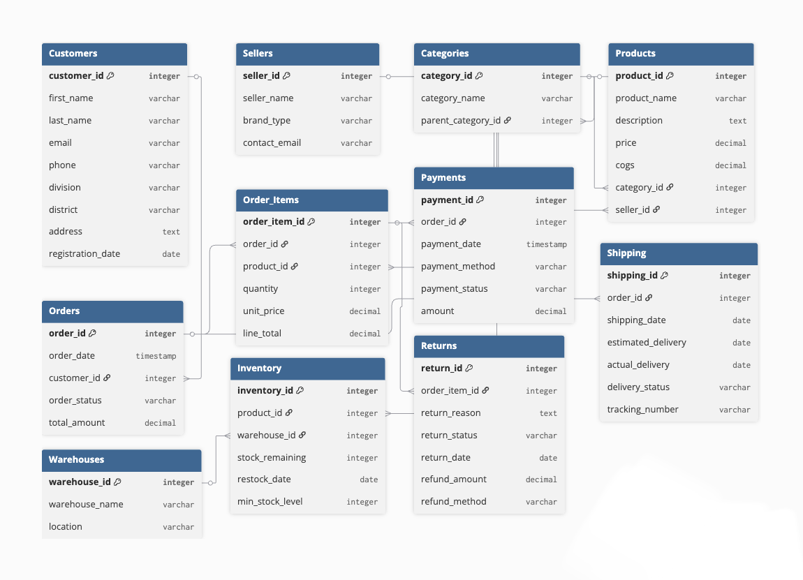

<p align="center">
  <h1 align="center">SalesDB</h1>
  <p align="center">
    <strong>E-Commerce Sales Analytics Platform</strong>
    <br />
    Full-stack DBMS with interactive dashboards, advanced SQL analytics, and database automation
    <br /><br />
    <a href="#quick-start">Quick Start</a> · <a href="#features">Features</a> · <a href="#database-design">Database Design</a> · <a href="#api-reference">API Reference</a>
  </p>
</p>

---

## At a Glance

| Metric | Value |
|--------|-------|
| **Database** | PostgreSQL 15 (Supabase) — 11 normalized tables (3NF) |
| **Backend** | Node.js + Express — 40+ RESTful endpoints |
| **Frontend** | React 18 SPA — 60+ Recharts chart components |
| **Data Span** | 2016–2025 synthetic dataset (~30K+ rows across tables) |
| **SQL Depth** | 12+ PL/pgSQL functions, 8 views, 2 triggers, cursors, CTEs |

---

---

## Snippets
<table>
<tr>
<td>

</td>
<td>

</td>
</tr>

<tr>
<td>

</td>
<td>

</td>
</tr>

<tr>
<td>

</td>
<td>

</td>
</tr>

<tr>
<td>

</td>
<td></td>
</tr>
</table>


---

## Quick Start

### Prerequisites

- **Node.js** v18+
- A **Supabase** project with the schema deployed (see [`db/`](./db))

### Backend

```bash
cd server
npm install
```

Create a `.env` file:

```env
SUPABASE_URL=your_supabase_url
SUPABASE_ANON_KEY=your_anon_key
```

```bash
npm run dev
# → http://localhost:5001
```

### Frontend

```bash
cd client
npm install
npm start
# → http://localhost:3000
```

---

## Architecture

```
SalesDB/
├── db/                  # SQL scripts — schema, views, functions, triggers, seed data
├── server/
│   └── src/
│       ├── config/      # Supabase client initialization
│       ├── controllers/ # 12 controller modules (analytics, CRUD, fraud, inventory, etc.)
│       ├── routes/      # Express route definitions
│       └── server.js    # Entry point (Express + CORS)
├── client/
│   └── src/
│       ├── pages/       # 6 main pages + 7 analytics sub-pages
│       ├── components/  # 60+ chart & UI components (Recharts)
│       └── api/         # Axios API client
└── sample_csv/          # Synthetic CSV data for import
```

**Data flow:** React → Axios → Express API → Supabase JS SDK → PostgreSQL (views / RPC functions)

---

## Features

### Phase 1 — Schema & Foundation

- 11 fully normalized tables covering the complete order lifecycle
- Foreign key constraints with enforced referential integrity
- Self-referencing `categories` table for hierarchical classification
- COGS stored per product for profit margin calculations

### Phase 2 — Core Transactional Dashboards

- **Daily Sales** — line charts with gradient fill, data tables with AOV
- **Quantity Sold** — 4-view dashboard (product / year / category / category-year)
- **Revenue Per Product** — horizontal bar ranking with year filter
- **Revenue Per Seller** — dual bar charts (revenue + products sold)
- **Revenue Per Category** — dual pie + dual bar charts

### Phase 3 — Time-Based & Customer Metrics

- Monthly revenue trends (all-years overlay on one chart)
- Monthly order count with all-years / per-year toggle
- Average Order Value with min, max, and **PERCENTILE_CONT** median
- Customer Lifetime Value — segmentation into VIP / High / Medium / Low Value

### Phase 4 — Seller Segmentation

- Inactive seller detection with configurable date range
- Summary metrics (inactive count, ratio) + month-by-month trend
- Full inactive seller list with "days since last sale"

### Phase 5 — Returns, Loss & Risk Analysis

- Most returned products (all-time / per-year / per-month tabs)
- Return rate % per product
- Revenue loss calculation from approved returns

### Phase 6 — Profit & Loss Analytics

- Product & category profit margins via cursor-based PL/pgSQL function
- Year-over-Year revenue growth with monthly breakdown
- Revenue decrease ratio analysis
- Monthly revenue drop detection with severity classification and auto-generated recommendations

### Phase 7 — Triggers & Automation

| Trigger | Event | Behavior |
|---------|-------|----------|
| `trigger_update_order_total` | AFTER INSERT/UPDATE/DELETE on `order_items` | Recalculates `orders.total_amount` |
| `trg_inventory_enforce_stock_limit_on_sale` | BEFORE INSERT on `order_items` | Blocks sale if insufficient stock; auto-deducts on success |

### Phase 8 — Advanced Deep Analytics

- **Fraud Detection** — multiple failed payments, high return-rate customers, seller return monitoring
- **Revenue Drop Analysis** — monthly, weekly, and yearly with severity classification
- **Inventory Intelligence** — low stock, fast-moving products, warehouse load, multi-factor risk scoring (CRITICAL → LOW)

### Data Management

Full CRUD operations across all 11 entities with table-specific forms, pagination, and trigger-driven auto-calculations.

---

## Tech Stack

| Layer | Technologies |
|-------|-------------|
| **Database** | PostgreSQL 15, Supabase, PL/pgSQL, SQL Views |
| **Backend** | Node.js v18+, Express.js v4, Supabase JS SDK v2, CORS, dotenv |
| **Frontend** | React 18, React Router v6, Recharts v2, Axios, CSS Modules |
| **Dev Tools** | Git, GitHub, VS Code, Postman, pgAdmin, Supabase Studio |

---

## Database Design

### Entity-Relationship Diagram



### Data Profile

| Table | Rows | Role |
|-------|------|------|
| `sellers` | ~50 | Vendor registry |
| `customers` | ~500 | Customer profiles + geographic segmentation |
| `products` | ~200 | Product catalog with COGS |
| `categories` | ~30 | Hierarchical classification (self-referencing) |
| `orders` | ~5,000 | Order headers (total_amount trigger-synced) |
| `order_items` | ~15,000 | Line items — central join table for all analytics |
| `payments` | ~5,500 | Payment records (supports fraud detection) |
| `shipping` | ~4,800 | Delivery tracking |
| `returns` | ~1,200 | Return records for risk analysis |
| `inventory` | ~400 | Per-product per-warehouse stock levels |
| `warehouses` | ~10 | Physical locations |

### Key Design Decisions

| Decision | Rationale |
|----------|-----------|
| **COGS in `products`** | Enables profit margin calculation without a separate cost table |
| **Self-referencing `categories`** | Tree hierarchy (e.g., Electronics → Phones → Smartphones) without extra tables |
| **Denormalized `total_amount`** | Persisted in `orders`, synced via AFTER trigger — avoids expensive real-time aggregation |
| **Per-row `min_stock_level`** | Allows per-product, per-warehouse stock thresholds — used by enforcement trigger |
| **Separate `payments` table** | Supports multiple attempts per order (FAILED → SUCCESS) for fraud detection |

---

## SQL Objects Summary

| Phase | Type | Object | Key Concepts |
|-------|------|--------|-------------|
| 2 | VIEW | `daily_sales_view`, `quantity_sold_by_*` | Date aggregation, COUNT DISTINCT |
| 2 | FUNCTION | `get_revenue_per_seller` | Explicit cursor (OPEN/FETCH/CLOSE) |
| 3 | FUNCTION | `get_monthly_revenue_per_year` | Cursor, TO_CHAR |
| 3 | FUNCTION | `get_average_order_value` | PERCENTILE_CONT, CTE |
| 3 | FUNCTION | `get_customer_lifetime_value` | Customer segmentation, CONCAT |
| 4 | FUNCTION | `get_inactive_sellers_analytics` | generate_series, json_build_object, NOT IN |
| 5 | VIEW | `product_returns_analytics` | COUNT FILTER, LEFT JOIN |
| 6 | FUNCTION | `get_product_profit_margin` | Cursor, COGS math, guarded division |
| 6 | FUNCTION | `get_revenue_decrease_ratio` | Self-join CTE, dual-CTE pipeline |
| 6 | FUNCTION | `get_yoy_revenue_growth` | Multi-CTE (4+), scalar subquery |
| 6 | FUNCTION | `get_monthly_revenue_drop_analysis` | generate_series, FOR loop, severity classification |
| 7 | TRIGGER | `trigger_update_order_total` | AFTER INSERT/UPDATE/DELETE, COALESCE |
| 7 | TRIGGER | `trg_inventory_enforce_stock_limit_on_sale` | BEFORE INSERT, RAISE EXCEPTION, auto-deduct |
| 8 | FUNCTION | `get_multiple_failed_payments` | HAVING, dynamic interval |
| 8 | FUNCTION | `get_high_return_customers` | Dual HAVING, NULLIF |
| 8 | FUNCTION | `get_low_stock_products` | Per-row threshold comparison |
| 8 | FUNCTION | `get_fast_moving_products` | Velocity rating, dynamic interval |
| 8 | FUNCTION | `get_inventory_intelligence_score` | Multi-factor scoring, days-of-stock formula |
| 8 | FUNCTION | `get_warehouse_load_intelligence` | Conditional COUNT, capacity tiers |

---

## API Reference

### Core Dashboards

| Method | Endpoint | Description |
|--------|----------|-------------|
| GET | `/api/daily-sales` | Daily sales with year filter |
| GET | `/api/quantity-sold` | Quantity by type (product/year/category) |
| GET | `/api/revenue-per-product` | Product revenue ranking |
| GET | `/api/revenue-per-seller` | Seller revenue ranking |
| GET | `/api/revenue-per-category` | Category revenue distribution |

### Time & Customer

| Method | Endpoint | Description |
|--------|----------|-------------|
| GET | `/api/monthly-revenue` | Monthly revenue per year |
| GET | `/api/monthly-order-count` | Monthly order volume |
| GET | `/api/average-order-value` | AOV with median (PERCENTILE_CONT) |
| GET | `/api/customer-lifetime-value` | CLTV with segmentation |

### Analytics & Intelligence

| Method | Endpoint | Description |
|--------|----------|-------------|
| GET | `/api/analytics/inactive-sellers` | Inactive sellers in date range |
| GET | `/api/analytics/returns` | Returns analytics (3 time views) |
| GET | `/api/profit-margin/product` | Product profit margins |
| GET | `/api/profit-margin/category` | Category profit margins |
| GET | `/api/yoy/revenue-decrease-ratio` | YoY revenue ratio |
| GET | `/api/yoy/revenue-growth` | YoY growth analysis |
| GET | `/api/fraud/failed-payments` | Multiple failed payments |
| GET | `/api/fraud/high-return-customers` | High return-rate customers |
| GET | `/api/revenue-drop/monthly` | Monthly revenue drops |
| GET | `/api/inventory/low-stock` | Low stock products |
| GET | `/api/inventory/fast-moving` | Fast-moving products |
| GET | `/api/inventory/warehouse-load` | Warehouse load metrics |
| GET | `/api/inventory/intelligence-score` | Inventory risk scoring |

### Data Management (CRUD)

| Method | Endpoint | Description |
|--------|----------|-------------|
| GET | `/api/data/:table` | Read records (paginated) |
| POST | `/api/data/:table` | Create record |
| PUT | `/api/data/:table/:id` | Update record |
| DELETE | `/api/data/:table/:id` | Delete record |

---

## Application Pages

| Page | Route | Description |
|------|-------|-------------|
| Landing | `/` | Entry point |
| Overview | `/dashboard/overview` | KPI summary cards |
| Analytics | `/dashboard/analytics` | Multi-phase analytics hub |
| Data Management | `/dashboard/data-management` | CRUD interface for all 11 entities |
| Inactive Sellers | `/dashboard/analytics/inactive-sellers-page` | Seller activity analysis |
| Returns | `/dashboard/returns` | Returns & loss analysis |
| Integrity | `/dashboard/integrity` | Data integrity & fraud dashboards |

---

## Known Limitations

| Limitation | Detail |
|-----------|--------|
| Hardcoded reference date | Phase 8 functions use `DATE '2025-12-31'` instead of `CURRENT_DATE` (static dataset) |
| No authentication | No RBAC or auth layer — all endpoints are public |
| Client-side aggregation | Returns view aggregation done in JS for multi-view flexibility |
| No real-time updates | Dashboards fetch on mount only — no WebSocket/polling |
| No server-side pagination | Some dashboards load full result sets |
| Single inventory record | Stock trigger uses `WHERE product_id = ...` without warehouse qualifier |

---

## License

This project was developed as a course project for **CSE 4532 — Database Management Systems Lab**.

---

<p align="center">
  <sub>Built with PostgreSQL · Node.js · React · Recharts</sub>
</p>
