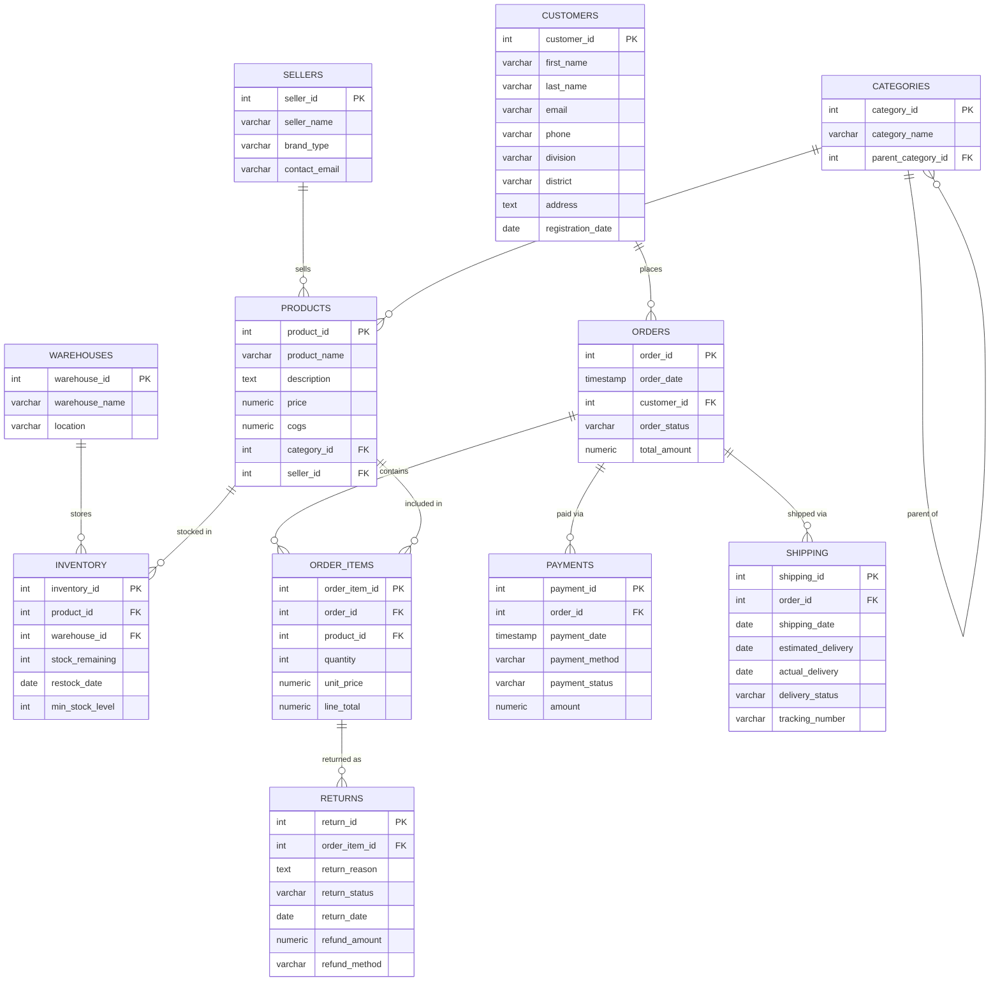

# SalesDB — Lab Report
## Part 2: Database Design

---

## 1. Overview

The SalesDB database follows a **fully normalized relational schema** (3NF) hosted on **Supabase (PostgreSQL 15)**. The schema models a complete e-commerce order lifecycle — from seller and product registration, customer ordering, payment processing, shipping, inventory management, and returns.

The database consists of **11 core tables** with enforced primary keys, foreign key constraints, and one self-referencing relationship.

---

## 2. Entity-Relationship Diagram (ERD)

The following Mermaid ERD represents all tables and their relationships:

---

## 3. Table Descriptions

### 3.1 `sellers`
Stores seller/vendor information.

| Column | Type | Notes |
|---|---|---|
| `seller_id` | INT | Primary Key |
| `seller_name` | VARCHAR | Store/brand name |
| `brand_type` | VARCHAR | e.g., "Official Store", "3rd Party" |
| `contact_email` | VARCHAR | Seller contact |

**Role**: Root entity for product ownership. Used in revenue analytics, seller performance dashboards and fraud detection.

---

### 3.2 `categories`
Stores product categories with **self-referencing hierarchy** for parent-child category trees.

| Column | Type | Notes |
|---|---|---|
| `category_id` | INT | Primary Key |
| `category_name` | VARCHAR | e.g., "Electronics", "Mobile Phones" |
| `parent_category_id` | INT | FK → `categories.category_id` (nullable) |

**Role**: Enables hierarchical product classification. Used in category-level revenue and profit analytics.

---

### 3.3 `products`
Core product catalog table linking sellers and categories.

| Column | Type | Notes |
|---|---|---|
| `product_id` | INT | Primary Key |
| `product_name` | VARCHAR | Product display name |
| `description` | TEXT | Long-form product description |
| `price` | NUMERIC | Selling price |
| `cogs` | NUMERIC | Cost of Goods Sold — used for profit margin calculation |
| `category_id` | INT | FK → `categories` |
| `seller_id` | INT | FK → `sellers` |

**Role**: Central reference for analytics. `cogs` enables margin calculation without a separate cost table.

---

### 3.4 `customers`
Customer profile data including geographic segmentation.

| Column | Type | Notes |
|---|---|---|
| `customer_id` | INT | Primary Key |
| `first_name` / `last_name` | VARCHAR | Full name |
| `email` | VARCHAR | Unique contact |
| `phone` | VARCHAR | — |
| `division` | VARCHAR | Regional classification (Bangladesh divisions) |
| `district` | VARCHAR | Sub-regional classification |
| `address` | TEXT | Full address |
| `registration_date` | DATE | Customer acquisition date |

**Role**: Used in CLTV (Customer Lifetime Value) analytics and fraud detection patterns.

---

### 3.5 `warehouses`
Physical warehouse locations.

| Column | Type | Notes |
|---|---|---|
| `warehouse_id` | INT | Primary Key |
| `warehouse_name` | VARCHAR | Warehouse label |
| `location` | VARCHAR | City or address |

**Role**: Used in inventory intelligence and warehouse load analytics.

---

### 3.6 `inventory`
Tracks stock levels per product per warehouse.

| Column | Type | Notes |
|---|---|---|
| `inventory_id` | INT | Primary Key |
| `product_id` | INT | FK → `products` |
| `warehouse_id` | INT | FK → `warehouses` |
| `stock_remaining` | INT | Current available stock |
| `restock_date` | DATE | Last restock date |
| `min_stock_level` | INT | Minimum safe stock threshold — used by triggers |

**Role**: Core table for inventory intelligence, low-stock detection, warehouse load, and the stock-enforcement trigger.

---

### 3.7 `orders`
Order header table.

| Column | Type | Notes |
|---|---|---|
| `order_id` | INT | Primary Key |
| `order_date` | TIMESTAMP | When order was placed |
| `customer_id` | INT | FK → `customers` |
| `order_status` | VARCHAR | e.g., Pending, Shipped, Completed, Cancelled, Refunded |
| `total_amount` | NUMERIC | Auto-calculated via trigger from `order_items` |

**Role**: Central table for all time-based and revenue analytics. `total_amount` is maintained automatically by the `trigger_update_order_total` trigger.

---

### 3.8 `order_items`
Line items within each order.

| Column | Type | Notes |
|---|---|---|
| `order_item_id` | INT | Primary Key |
| `order_id` | INT | FK → `orders` |
| `product_id` | INT | FK → `products` |
| `quantity` | INT | Units ordered |
| `unit_price` | NUMERIC | Price at time of purchase |
| `line_total` | NUMERIC | `quantity × unit_price` |

**Role**: Most commonly joined table in the system. All revenue, quantity, and profit calculations flow through `order_items`.

---

### 3.9 `payments`
Payment records per order.

| Column | Type | Notes |
|---|---|---|
| `payment_id` | INT | Primary Key |
| `order_id` | INT | FK → `orders` |
| `payment_date` | TIMESTAMP | When payment was processed |
| `payment_method` | VARCHAR | e.g., Credit Card, COD, Mobile Banking |
| `payment_status` | VARCHAR | SUCCESS, FAILED, PENDING |
| `amount` | NUMERIC | Payment amount |

**Role**: Used in fraud detection (multiple failed payment pattern).

---

### 3.10 `shipping`
Shipping and delivery tracking per order.

| Column | Type | Notes |
|---|---|---|
| `shipping_id` | INT | Primary Key |
| `order_id` | INT | FK → `orders` |
| `shipping_date` | DATE | Dispatch date |
| `estimated_delivery` | DATE | Expected arrival |
| `actual_delivery` | DATE | Actual arrival |
| `delivery_status` | VARCHAR | e.g., In Transit, Delivered |
| `tracking_number` | VARCHAR | Courier reference |

**Role**: Supports delivery fulfillment analysis and order completion logic (Phase 7).

---

### 3.11 `returns`
Product return records linked to specific order line items.

| Column | Type | Notes |
|---|---|---|
| `return_id` | INT | Primary Key |
| `order_item_id` | INT | FK → `order_items` |
| `return_reason` | TEXT | Customer-provided reason |
| `return_status` | VARCHAR | Pending, Approved, Rejected |
| `return_date` | DATE | When return was filed |
| `refund_amount` | NUMERIC | Monetary refund value |
| `refund_method` | VARCHAR | Refund channel |

**Role**: Central table for Phase 5 returns analytics, revenue loss calculation, and seller/customer fraud detection.

---

## 4. Key Design Decisions

### 4.1 COGS in Products Table
Rather than a separate cost ledger, `cogs` (Cost of Goods Sold) is stored per product. This simplifies profit margin calculations while being accurate for a per-product cost model.

### 4.2 Self-Referencing Categories
The `parent_category_id` FK on `categories` enables a hierarchical category structure (e.g., *Electronics → Mobile Phones → Smartphones*) without requiring a separate table.

### 4.3 Denormalized `total_amount` in Orders
`orders.total_amount` is a derived field (sum of `order_items.line_total`), but is persisted in the table and kept in sync via a database trigger. This avoids expensive real-time aggregations on every order read.

### 4.4 `min_stock_level` in Inventory
Storing the minimum threshold directly in the `inventory` record (rather than a global setting) allows per-product, per-warehouse stock floor customization — critical for the stock enforcement trigger.

### 4.5 Separate Payments and Shipping Tables
A single order can have multiple payment attempts (e.g., an initial FAILED followed by SUCCESS). Separating payments from orders supports fraud detection on multiple failed payment patterns.

---

## 5. Database Views (Phase 2 SQL)

Pre-computed views power the Phase 2 dashboards and are queried directly via Supabase's PostgREST API:

| View Name | Purpose |
|---|---|
| `daily_sales_view` | Daily aggregated sales amount, order count, items sold |
| `daily_sales_years` | Distinct years present in daily sales data |
| `total_quantity_sold_per_product` | All-time quantity per product |
| `quantity_sold_by_year` | Quantity per product per year |
| `quantity_sold_by_category` | Quantity per category (all-time) |
| `quantity_sold_by_category_year` | Quantity per category per year |
| `quantity_sold_years` | Distinct years for quantity sold filtering |
| `product_returns_analytics` | Combined return metrics by product, year, and month |

---

## 6. Sample Data Profile

| Table | Approximate Row Count |
|---|---|
| sellers | ~50 |
| customers | ~500 |
| products | ~200 |
| orders | ~5,000 |
| order_items | ~15,000 |
| payments | ~5,500 |
| shipping | ~4,800 |
| returns | ~1,200 |
| inventory | ~400 |
| warehouses | ~10 |
| categories | ~30 |

Data spans **2016–2025**, with synthetic fraud patterns injected for testing Phase 8 analytics.

---

*Continue in REPORT_PART3.md → Phase 1–5 SQL: Views, Functions & Queries*
